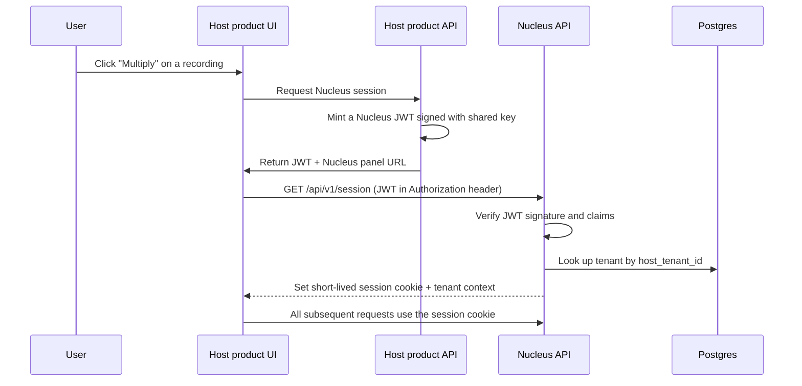

# Authentication

Nucleus does not own user identity. Identity lives in the host product
(TruPeer for the first deployment) and is delegated to Nucleus through
a token exchange. This page describes how the handoff works, what
claims Nucleus trusts, and how the authorization model maps onto the
state machine.

## Why delegated auth

Three reasons.

1. **The host product owns the customer relationship.** A user already
   logged into TruPeer should not see a second login screen for
   Nucleus. The user experience must be seamless.
2. **Compliance inheritance.** TruPeer holds SOC 2, ISO 27001, GDPR,
   SSO, SCIM. Nucleus inherits the certification by routing every
   identity decision through TruPeer's existing identity stack.
3. **Tenant isolation is anchored to host identity.** A Nucleus tenant
   maps 1:1 to a host tenant. There is no version of Nucleus where a
   user has a different identity in Nucleus than in the host.

## The handoff

### Token exchange flow



### JWT structure

The host signs a JWT with a shared symmetric key (HS256) or an
asymmetric key (RS256, preferred for production). The Nucleus API
verifies the signature against the host's public key.

```json
{
  "iss": "trupeer.ai",
  "sub": "user_5f3b9c2e",
  "aud": "nucleus",
  "exp": 1712765400,
  "iat": 1712761800,
  "jti": "8f4a1c7d-...-...",
  "host_tenant_id": "tenant_acme_corp",
  "host_user_id": "user_5f3b9c2e",
  "email": "marketer@acme.example",
  "name": "Avery Marketer",
  "scopes": [
    "nucleus:job:create",
    "nucleus:job:read",
    "nucleus:variant:read",
    "nucleus:variant:download",
    "nucleus:report:read"
  ],
  "roles": ["editor"]
}
```

### Claims Nucleus trusts

| Claim | What it controls | Required |
|---|---|---|
| `iss` | Issuer must be one of the registered host products | Yes |
| `aud` | Must be `nucleus` | Yes |
| `exp` | JWT expiration (max 1 hour) | Yes |
| `iat` | Issued-at, used to detect clock skew | Yes |
| `jti` | Token ID for one-time-use enforcement (if needed) | No |
| `host_tenant_id` | Maps to Nucleus tenant via lookup | Yes |
| `host_user_id` | Used for audit attribution | Yes |
| `email` | Used for notification + audit; not used for authz | No |
| `scopes` | Fine-grained permissions on Nucleus resources | Yes |
| `roles` | Coarse role labels (`editor`, `viewer`, `admin`) | No |

The Nucleus API rejects any token missing a required claim or with an
unrecognized issuer.

### Tenant lookup

`host_tenant_id` is the foreign key to the Nucleus `tenants` table.
The first time a user from a new host tenant arrives, Nucleus
auto-provisions a tenant row with default settings:

```python
def get_or_create_tenant(host_tenant_id: str, name: str = None) -> Tenant:
    tenant = Tenant.get_by_host_id(host_tenant_id)
    if tenant:
        return tenant
    return Tenant.create(
        host_tenant_id=host_tenant_id,
        name=name or host_tenant_id,
        plan="enterprise_addon",
        settings=DEFAULT_TENANT_SETTINGS,
    )
```

Auto-provisioning is gated by a host-product-level allowlist: only
hosts that have explicitly enabled Nucleus for their tenants can
trigger auto-provisioning. Otherwise, a 403 is returned and the host
must provision the tenant out-of-band first.

## Session cookies

After the JWT exchange, the Nucleus API issues a short-lived session
cookie scoped to the Nucleus subdomain:

```
Set-Cookie: nucleus_session=<opaque-token>; HttpOnly; Secure; SameSite=Strict; Max-Age=3600
```

The opaque token is a server-side session ID. Cookie contents never
include user identity directly — the server-side session is the
authoritative store.

The session cookie is required for every subsequent API request. The
JWT is single-use: it cannot be replayed to create a second session.

## Scopes

The scope vocabulary uses a `resource:action` pattern.

| Scope | What it allows |
|---|---|
| `nucleus:job:create` | Submit a new brief |
| `nucleus:job:read` | List and view jobs |
| `nucleus:job:cancel` | Manually cancel a running job |
| `nucleus:job:delete` | Delete a job and its variants (subject to retention) |
| `nucleus:variant:read` | View variant metadata + previews |
| `nucleus:variant:download` | Download the variant file |
| `nucleus:report:read` | Read neural reports |
| `nucleus:report:export` | Export the neural report as PDF |
| `nucleus:gtm:read` | Read GTM strategy guides |
| `nucleus:brand_kb:read` | View Brand KB contents |
| `nucleus:brand_kb:write` | Add/update/delete documents in the Brand KB |
| `nucleus:settings:read` | View tenant settings |
| `nucleus:settings:write` | Modify tenant settings (scoring weights, defaults) |
| `nucleus:billing:read` | View usage metering |
| `nucleus:admin:*` | Tenant-level admin (deletion, role assignment) |

The host product is responsible for mapping its own user roles to
Nucleus scopes when minting the JWT. A "viewer" role at TruPeer might
get `nucleus:job:read`, `nucleus:variant:read`, `nucleus:report:read`
only. An "admin" role gets the full set including `nucleus:admin:*`.

## Authorization checks

Every API endpoint declares the scope it requires. The auth dependency
validates the session and the scope in one step:

```python
@router.post("/api/v1/jobs", dependencies=[Depends(require_scope("nucleus:job:create"))])
async def create_job(brief: BriefSchema, ctx: TenantContext) -> JobResponse:
    job_id = await brief_submit(brief.dict(), tenant_id=ctx.tenant_id)
    return JobResponse(job_id=job_id)
```

`require_scope` raises 403 if the session is missing the requested
scope. There is no role-to-scope translation in the endpoint code —
the JWT mint already did that.

## Rate limiting on auth

Three tiers of rate limit on authentication endpoints:

| Endpoint | Limit | Window |
|---|---|---|
| `POST /api/v1/session` (JWT exchange) | 60 per IP | 1 minute |
| Failed signature verification | 10 per IP | 1 minute (then 1-hour ban) |
| Failed claim validation | 30 per host_tenant_id | 5 minutes |

A burst of failed signature verifications looks like an attack on the
host's signing key — the rate limit is intentionally aggressive.

## Token rotation

The host's signing key is rotated quarterly via JWKS. Nucleus polls the
host's `/.well-known/jwks.json` endpoint every 5 minutes and caches
keys with their `kid` identifier. When the host signs with a new key,
Nucleus picks it up automatically without a redeploy.

The cache has a fallback: if the JWKS endpoint is unreachable, Nucleus
serves cached keys for up to 24 hours. After 24 hours, JWT verification
starts failing, triggering a page.

## Webhook auth (host → Nucleus)

When the host product wants to push events to Nucleus (e.g., a tenant
was deleted), the host signs the webhook payload with HMAC-SHA256
using a shared secret stored in Nucleus's secret manager. Nucleus
verifies the signature before processing the event.

```python
@router.post("/api/v1/webhooks/host")
async def receive_host_webhook(
    request: Request,
    x_signature: str = Header(...),
) -> Response:
    body = await request.body()
    expected = hmac.new(WEBHOOK_SECRET, body, hashlib.sha256).hexdigest()
    if not hmac.compare_digest(x_signature, expected):
        raise HTTPException(401, "Invalid signature")
    event = json.loads(body)
    await process_host_event(event)
    return Response(status_code=200)
```

## Service-to-service auth (Nucleus → external providers)

Outbound calls to providers (NeuroPeer, Veo 3.1, HeyGen, ElevenLabs,
Lyria) use API keys held in the secret manager. Each provider has its
own key. Keys are rotated quarterly via the
[security](security.md#secret-rotation) workflow.

## What this design intentionally avoids

- **No password auth.** Nucleus has zero password storage. All identity
  comes from the host.
- **No SSO/SAML directly.** SSO is the host's responsibility. Nucleus
  trusts the host's identity assertion.
- **No social login.** Same reason.
- **No long-lived API tokens.** All Nucleus access goes through
  per-session JWTs (1-hour expiry) or scoped admin keys held in the
  secret manager. There's no "personal access token" UI.
- **No OAuth2 dance for end users.** The token exchange uses signed
  JWT instead of an OAuth code-flow because the host is the trusted
  identity provider, not a third party.
