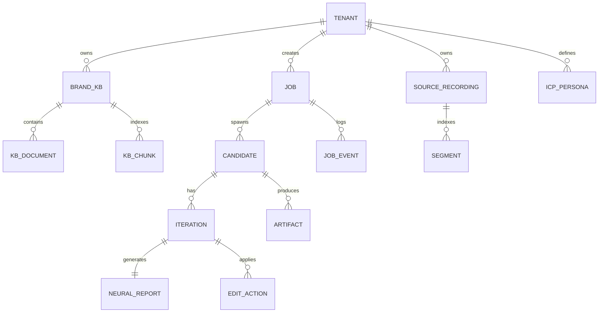

# Data Model

The Nucleus engine persists every piece of state to Postgres. Object
storage (S3 / MinIO) holds video files and large blobs. Redis is the
Celery broker plus a thin cache. Nothing is held only in memory.

## Top-level entities



## Schema — core tables

### `tenants`

The top-level scoping object. One row per host-product customer that
has access to Nucleus.

```sql
CREATE TABLE tenants (
    id              UUID PRIMARY KEY DEFAULT gen_random_uuid(),
    host_tenant_id  TEXT NOT NULL UNIQUE,  -- the host product's ID
    name            TEXT NOT NULL,
    plan            TEXT NOT NULL DEFAULT 'enterprise_addon',
    status          TEXT NOT NULL DEFAULT 'active',
    settings        JSONB NOT NULL DEFAULT '{}',
    created_at      TIMESTAMPTZ NOT NULL DEFAULT now(),
    updated_at      TIMESTAMPTZ NOT NULL DEFAULT now()
);

CREATE INDEX idx_tenants_host_id ON tenants(host_tenant_id);
```

`settings` JSONB holds tenant-level overrides: default scoring weights,
default archetype set, default language whitelist, default cost
ceilings.

### `brand_kbs`

A brand knowledge base. Each tenant owns one or more.

```sql
CREATE TABLE brand_kbs (
    id              UUID PRIMARY KEY DEFAULT gen_random_uuid(),
    tenant_id       UUID NOT NULL REFERENCES tenants(id) ON DELETE CASCADE,
    name            TEXT NOT NULL,
    provider        TEXT NOT NULL,  -- 'lightrag' | 'llamaindex' | 'raganything'
    embedding_model TEXT NOT NULL,
    storage_path    TEXT NOT NULL,  -- S3 prefix
    document_count  INTEGER NOT NULL DEFAULT 0,
    chunk_count     INTEGER NOT NULL DEFAULT 0,
    last_indexed_at TIMESTAMPTZ,
    created_at      TIMESTAMPTZ NOT NULL DEFAULT now(),
    UNIQUE (tenant_id, name)
);

CREATE INDEX idx_brand_kbs_tenant ON brand_kbs(tenant_id);
```

### `kb_documents`

Individual documents inside a Brand KB. Each document is hashed for
deduplication and tagged for retrieval scoping.

```sql
CREATE TABLE kb_documents (
    id            UUID PRIMARY KEY DEFAULT gen_random_uuid(),
    brand_kb_id   UUID NOT NULL REFERENCES brand_kbs(id) ON DELETE CASCADE,
    source_type   TEXT NOT NULL,  -- 'pdf' | 'markdown' | 'url' | 'notion' | 'mcp'
    source_uri    TEXT NOT NULL,
    sha256        TEXT NOT NULL,
    title         TEXT,
    language      TEXT,
    icp_tags      TEXT[],
    pain_tags     TEXT[],
    freshness_at  TIMESTAMPTZ,
    storage_path  TEXT NOT NULL,
    created_at    TIMESTAMPTZ NOT NULL DEFAULT now(),
    UNIQUE (brand_kb_id, sha256)
);

CREATE INDEX idx_kb_documents_kb ON kb_documents(brand_kb_id);
CREATE INDEX idx_kb_documents_icp_tags ON kb_documents USING GIN (icp_tags);
CREATE INDEX idx_kb_documents_pain_tags ON kb_documents USING GIN (pain_tags);
```

### `source_recordings`

Brand-owned video assets the engine generates variants from.

```sql
CREATE TABLE source_recordings (
    id              UUID PRIMARY KEY DEFAULT gen_random_uuid(),
    tenant_id       UUID NOT NULL REFERENCES tenants(id) ON DELETE CASCADE,
    host_asset_id   TEXT,  -- pointer to the host product's recording ID
    name            TEXT NOT NULL,
    duration_s      NUMERIC,
    storage_path    TEXT NOT NULL,
    transcript      JSONB,
    embeddings_path TEXT,
    created_at      TIMESTAMPTZ NOT NULL DEFAULT now()
);

CREATE INDEX idx_source_recordings_tenant ON source_recordings(tenant_id);
```

### `segments`

Time-slice segments of a source recording, with embeddings for semantic
search.

```sql
CREATE TABLE segments (
    id              UUID PRIMARY KEY DEFAULT gen_random_uuid(),
    recording_id    UUID NOT NULL REFERENCES source_recordings(id) ON DELETE CASCADE,
    start_s         NUMERIC NOT NULL,
    end_s           NUMERIC NOT NULL,
    text            TEXT,
    embedding       VECTOR(1024),
    semantic_tags   TEXT[]
);

CREATE INDEX idx_segments_recording ON segments(recording_id);
CREATE INDEX idx_segments_embedding ON segments USING ivfflat (embedding vector_cosine_ops);
```

### `icp_personas`

The brand's library of target personas.

```sql
CREATE TABLE icp_personas (
    id              UUID PRIMARY KEY DEFAULT gen_random_uuid(),
    tenant_id       UUID NOT NULL REFERENCES tenants(id) ON DELETE CASCADE,
    name            TEXT NOT NULL,
    role            TEXT,
    company_type    TEXT,
    seniority       TEXT,
    pain_points     TEXT[],
    objections      TEXT[],
    preferred_tone  TEXT,
    preferred_lang  TEXT[],
    metadata        JSONB DEFAULT '{}',
    created_at      TIMESTAMPTZ NOT NULL DEFAULT now(),
    UNIQUE (tenant_id, name)
);
```

### `jobs`

A Nucleus job — one brief, expanded into many candidates.

```sql
CREATE TABLE jobs (
    id              UUID PRIMARY KEY DEFAULT gen_random_uuid(),
    tenant_id       UUID NOT NULL REFERENCES tenants(id) ON DELETE CASCADE,
    brief           JSONB NOT NULL,
    status          TEXT NOT NULL DEFAULT 'briefed',  -- briefed|planning|generating|delivering|complete|failed
    score_threshold NUMERIC NOT NULL DEFAULT 72,
    max_iterations  INTEGER NOT NULL DEFAULT 5,
    cost_ceiling_usd NUMERIC,
    time_ceiling_s  INTEGER,
    started_at      TIMESTAMPTZ,
    completed_at    TIMESTAMPTZ,
    created_by      TEXT,
    created_at      TIMESTAMPTZ NOT NULL DEFAULT now(),
    updated_at      TIMESTAMPTZ NOT NULL DEFAULT now()
);

CREATE INDEX idx_jobs_tenant_status ON jobs(tenant_id, status);
CREATE INDEX idx_jobs_created ON jobs(created_at DESC);
```

### `candidates`

A single candidate variant inside a job. The cross-product expansion
produces one candidate per `(icp, language, archetype, platform, variant_index)`
cell.

```sql
CREATE TABLE candidates (
    id              UUID PRIMARY KEY DEFAULT gen_random_uuid(),
    job_id          UUID NOT NULL REFERENCES jobs(id) ON DELETE CASCADE,
    tenant_id       UUID NOT NULL REFERENCES tenants(id) ON DELETE CASCADE,
    icp_persona_id  UUID REFERENCES icp_personas(id),
    language        TEXT NOT NULL,
    archetype       TEXT NOT NULL,
    platform        TEXT NOT NULL,
    variant_index   INTEGER NOT NULL,
    status          TEXT NOT NULL DEFAULT 'pending',
    iteration_count INTEGER NOT NULL DEFAULT 0,
    final_score     NUMERIC,
    terminal_reason TEXT,
    cost_usd        NUMERIC NOT NULL DEFAULT 0,
    started_at      TIMESTAMPTZ,
    completed_at    TIMESTAMPTZ,
    created_at      TIMESTAMPTZ NOT NULL DEFAULT now()
);

CREATE INDEX idx_candidates_job ON candidates(job_id);
CREATE INDEX idx_candidates_tenant_status ON candidates(tenant_id, status);
```

### `iterations`

One row per loop iteration on a candidate. Stores the score delta and
the edit action that produced this iteration's output.

```sql
CREATE TABLE iterations (
    id              UUID PRIMARY KEY DEFAULT gen_random_uuid(),
    candidate_id    UUID NOT NULL REFERENCES candidates(id) ON DELETE CASCADE,
    iteration_index INTEGER NOT NULL,
    parent_iteration_id UUID REFERENCES iterations(id),
    edit_action     JSONB,  -- the EditAction that produced this iteration (null for iter 0)
    artifact_path   TEXT NOT NULL,  -- S3 path to the rendered video
    score_composite NUMERIC,
    score_metrics   JSONB,  -- the 18 NeuroPeer metrics
    score_delta     NUMERIC,
    cost_usd        NUMERIC NOT NULL DEFAULT 0,
    started_at      TIMESTAMPTZ NOT NULL DEFAULT now(),
    completed_at    TIMESTAMPTZ,
    UNIQUE (candidate_id, iteration_index)
);

CREATE INDEX idx_iterations_candidate ON iterations(candidate_id);
```

### `neural_reports`

The full neural analysis attached to each delivered iteration.

```sql
CREATE TABLE neural_reports (
    id              UUID PRIMARY KEY DEFAULT gen_random_uuid(),
    iteration_id    UUID NOT NULL UNIQUE REFERENCES iterations(id) ON DELETE CASCADE,
    timeseries      JSONB NOT NULL,  -- per-second metric values
    brain_map_path  TEXT,  -- S3 path to a 3D activation map snapshot
    key_moments     JSONB,
    pdf_path        TEXT,  -- exported PDF
    created_at      TIMESTAMPTZ NOT NULL DEFAULT now()
);
```

### `gtm_guides`

The GTM strategy guide attached to each completed job.

```sql
CREATE TABLE gtm_guides (
    id              UUID PRIMARY KEY DEFAULT gen_random_uuid(),
    job_id          UUID NOT NULL UNIQUE REFERENCES jobs(id) ON DELETE CASCADE,
    icp_pairings    JSONB NOT NULL,
    platform_pairings JSONB NOT NULL,
    launch_cadence  JSONB,
    ab_recommendations JSONB,
    pdf_path        TEXT,
    created_at      TIMESTAMPTZ NOT NULL DEFAULT now()
);
```

### `artifacts`

Generic blob registry — every video file, every report, every doc
delta.

```sql
CREATE TABLE artifacts (
    id              UUID PRIMARY KEY DEFAULT gen_random_uuid(),
    tenant_id       UUID NOT NULL REFERENCES tenants(id) ON DELETE CASCADE,
    candidate_id    UUID REFERENCES candidates(id) ON DELETE CASCADE,
    iteration_id    UUID REFERENCES iterations(id) ON DELETE CASCADE,
    kind            TEXT NOT NULL,  -- 'video' | 'report_pdf' | 'gtm_guide_pdf' | 'doc_delta'
    storage_path    TEXT NOT NULL,
    bytes           BIGINT,
    duration_s      NUMERIC,
    sha256          TEXT,
    created_at      TIMESTAMPTZ NOT NULL DEFAULT now()
);

CREATE INDEX idx_artifacts_tenant_kind ON artifacts(tenant_id, kind);
CREATE INDEX idx_artifacts_iteration ON artifacts(iteration_id);
```

### `job_events`

Append-only event log for every state transition. The source of truth
for "what happened" when something goes wrong.

```sql
CREATE TABLE job_events (
    id              BIGSERIAL PRIMARY KEY,
    job_id          UUID NOT NULL REFERENCES jobs(id) ON DELETE CASCADE,
    candidate_id    UUID REFERENCES candidates(id) ON DELETE CASCADE,
    iteration_id    UUID REFERENCES iterations(id) ON DELETE CASCADE,
    event_type      TEXT NOT NULL,
    payload         JSONB NOT NULL,
    created_at      TIMESTAMPTZ NOT NULL DEFAULT now()
);

CREATE INDEX idx_job_events_job ON job_events(job_id, created_at);
```

### `usage_events`

Per-tenant metering for billing handoff.

```sql
CREATE TABLE usage_events (
    id              BIGSERIAL PRIMARY KEY,
    tenant_id       UUID NOT NULL REFERENCES tenants(id) ON DELETE CASCADE,
    job_id          UUID REFERENCES jobs(id),
    candidate_id    UUID REFERENCES candidates(id),
    event_type      TEXT NOT NULL,  -- 'variant_delivered' | 'iteration_run' | 'score_computed' | 'report_exported'
    units           INTEGER NOT NULL DEFAULT 1,
    cost_usd        NUMERIC,
    metadata        JSONB,
    created_at      TIMESTAMPTZ NOT NULL DEFAULT now()
);

CREATE INDEX idx_usage_events_tenant_time ON usage_events(tenant_id, created_at);
```

## Row-level security

Every tenant-scoped table has a row-level security policy that restricts
SELECT/UPDATE/DELETE to rows where `tenant_id = current_setting('nucleus.tenant_id')::UUID`.
The application sets `nucleus.tenant_id` at the start of every request
from the JWT claims.

```sql
ALTER TABLE jobs ENABLE ROW LEVEL SECURITY;

CREATE POLICY tenant_isolation_jobs ON jobs
    USING (tenant_id = current_setting('nucleus.tenant_id', true)::UUID);

-- Repeat for: brand_kbs, kb_documents, source_recordings, segments,
-- icp_personas, candidates, iterations, neural_reports, gtm_guides,
-- artifacts, job_events, usage_events
```

A privileged "system" role bypasses RLS for orchestrator background
tasks that need cross-tenant visibility (cost rollups, observability,
admin operations). Application worker processes never use the system
role.

## Indexes and partitioning

Hot tables that grow unboundedly:

| Table | Partition strategy | Reason |
|---|---|---|
| `job_events` | Range on `created_at` (monthly) | Append-only, queried by recent date |
| `usage_events` | Range on `created_at` (monthly) | Same |
| `iterations` | Hash on `tenant_id` if a single tenant grows past ~10M rows | Per-tenant query patterns |
| `artifacts` | Hash on `tenant_id` at the same threshold | Same |

Default to no partitioning until volume justifies it. Postgres handles
hundreds of millions of rows in a single table fine for the workload
patterns Nucleus has.

## Vector storage

`segments.embedding` and `kb_chunks.embedding` (in the LightRAG store)
use `pgvector` for cosine similarity search. Initial dimension is 1024
(matching the chosen embedding model — see
[ingestion](../ingestion/brand-kb-schema.md)).

## Migrations

Migrations live in `nucleus/db/migrations/` and use Alembic. Every
migration is reversible. Every schema change ships with a migration
test that runs both `upgrade` and `downgrade` in CI against a
disposable Postgres instance.

## What's not in Postgres

- **Video files, audio files, PDFs** — S3 / MinIO with per-tenant prefixes
- **Vector indexes for RAG** — LightRAG / LlamaIndex storage directories
  on disk per Brand KB (in addition to pgvector for segments)
- **Celery task queue** — Redis
- **Hot cache for inference results** — Redis with 7-day TTL
- **Rate-limit counters** — Redis with per-tenant keys

## Backup and retention

| Object | Backup | Retention |
|---|---|---|
| Postgres | Daily snapshot via Railway, point-in-time recovery 7 days | 30 days hot |
| S3 artifacts | Versioned bucket, lifecycle to glacier after 90 days | 2 years (configurable per tenant) |
| Brand KB indexes | Snapshotted with the underlying disk | Same as Postgres |
| Logs | Loki retention | 30 days |
| Audit events (job_events) | Postgres | Indefinite (never auto-purge) |

Per-tenant retention overrides live in the `tenants.settings` JSONB so
that customers with stricter data-residency or right-to-erasure needs
can shorten the lifecycle.
