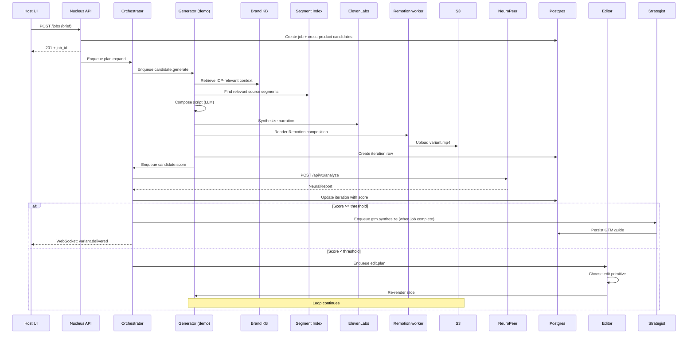
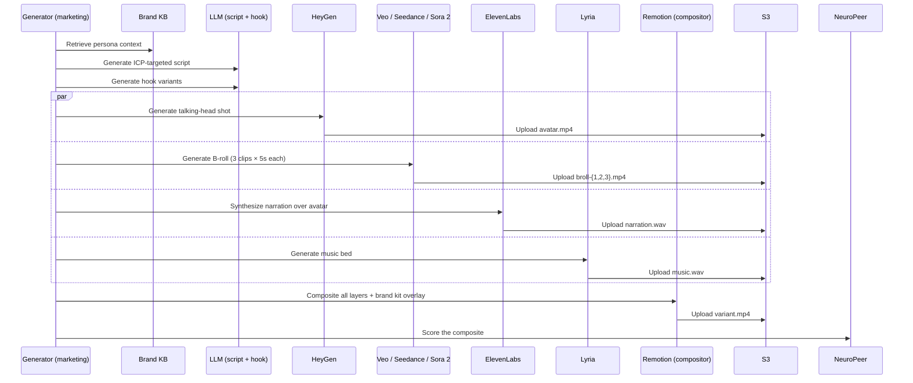
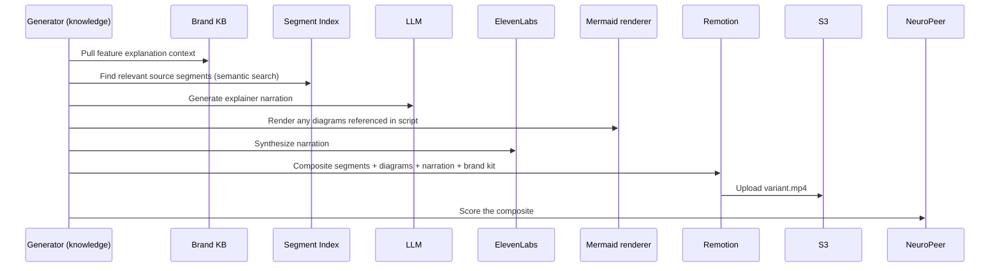
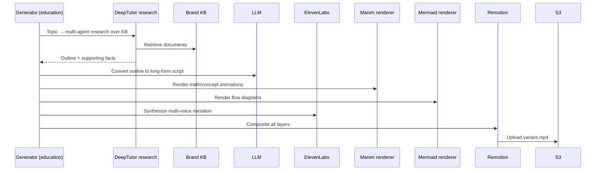
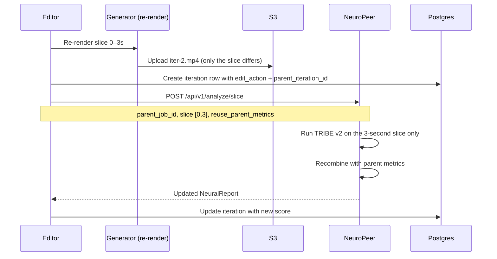

# Dataflow

This page traces the actual data flow through the engine for each of
the four output archetypes. Each diagram shows where data enters,
which services it touches, what gets persisted, and what gets emitted
back to the host product.

## Demo archetype dataflow

### Data flowing through the demo archetype

| Stage | Data | Storage |
|---|---|---|
| Brief | ICPs, languages, archetypes, platforms, threshold | `jobs.brief` (JSONB) |
| Plan expansion | One row per cell | `candidates` table |
| Brand KB retrieval | Document chunks + embeddings | LightRAG store |
| Segment selection | Time slices from source recording | `segments` table |
| Script | Generated text (per ICP, per language) | In-memory; not persisted (but reproducible from brief + KB version) |
| Narration audio | WAV file | S3 (temporary, 24-hour TTL) |
| Composition | Rendered MP4 | S3 (`tenants/{id}/jobs/{job_id}/candidates/{id}/iter-0.mp4`) |
| Score | Per-metric values + composite | `iterations.score_metrics` (JSONB), `iterations.score_composite` |
| Final variant | MP4 | S3 (`tenants/{id}/variants/{id}.mp4`) |
| Neural report | Per-second timeseries + brain map snapshot | `neural_reports` table + S3 PDF |
| GTM guide | ICP/platform pairings | `gtm_guides` table + S3 PDF |
| Doc delta (optional) | Markdown SOP fragment | S3 |

## Marketing archetype dataflow

The marketing archetype uses the avatar layer (HeyGen via the host's
existing partnership) and diffusion B-roll, so the dataflow has more
external provider hops.

### Provider call summary per marketing variant

| Provider | Calls per variant | Cost per call (est.) |
|---|---|---|
| LLM (generator) | 2–4 | $0.005 each |
| HeyGen avatar | 1 | $0.15 |
| Diffusion B-roll | 3 | $0.13 each |
| ElevenLabs voice | 1 | $0.05 |
| Lyria music | 1 | $0.01 |
| Remotion render | 1 (local) | ~$0 |
| NeuroPeer score | 1 (full) + 0–4 (slice on edits) | $0.08 first, $0.03 slices |
| **Per variant** | **9–13 provider calls** | **~$0.65** |

## Knowledge archetype dataflow

The knowledge archetype is heavier on the segment-reuse side and
lighter on diffusion. Source recording segments make up the bulk of
the visual content; the generator overlays diagrams and updated
narration.

The knowledge archetype rarely calls diffusion. When it does (for
metaphor-driven story beats), it's gated behind a "creative" flag in
the brief.

## Education archetype dataflow

Education adds Manim and a longer research pipeline. The generator
calls DeepTutor's research agent to expand a topic into a structured
outline before scripting.

Education variants are 5–15 minutes, so they make many more provider
calls than the other archetypes. Cost per variant runs $1.50–$3.00
depending on Manim render time and narration length.

## Scoring slice dataflow

When the editor changes a slice and the orchestrator calls the
slice-scoring endpoint, only the changed bytes are scored:

The slice scoring endpoint is the one upstream change Nucleus requires
on NeuroPeer. Without it, every iteration would re-score the full
video and per-iteration cost would be ~$0.08 instead of ~$0.03 — a
~70% increase that would meaningfully change the unit economics.

## Failure paths

Every dataflow above has explicit failure handling. The detailed
catalog lives in [failure modes](failure-modes.md). Quick summary:

| Where it fails | What happens |
|---|---|
| Brand KB retrieval returns nothing | Generator falls back to a generic template; the iteration is tagged `kb_miss` for review |
| Source segment search returns no good matches | Generator uses the full source recording's first 8 seconds; the iteration is tagged `segment_fallback` |
| Provider 5xx | Celery retry policy (3–5 retries with backoff); after exhaustion, candidate fails |
| Provider 4xx (auth, validation) | No retry; candidate fails immediately |
| Score returns NaN or invalid metrics | Iteration logs the anomaly; orchestrator treats as `score=0` and lets the loop continue |
| Edit primitive picks a no-op edit | Stop condition `monotone_failure` fires after 2 such iterations |
| Storage upload fails | Retry with backoff; if it fails 3 times, candidate fails |
| Database write conflict | Optimistic lock retry on the orchestrator side |

## Cross-tenant boundary verification

Every dataflow above is gated by the tenant context. The arrows in
the diagrams cross many service boundaries — at every boundary, the
tenant ID is the first thing checked:

- API entry: JWT claim → set `nucleus.tenant_id` in Postgres session
- Worker entry: deserialize tenant ID from task payload → set context
- S3 access: every key starts with `tenants/{tenant_id}/`
- Provider call: every outbound request includes the tenant ID as a
  header

A bug that misroutes data across tenants is caught at one of these
boundaries. The [tenant isolation](tenant-isolation.md) page describes
the enforcement layers in detail.
