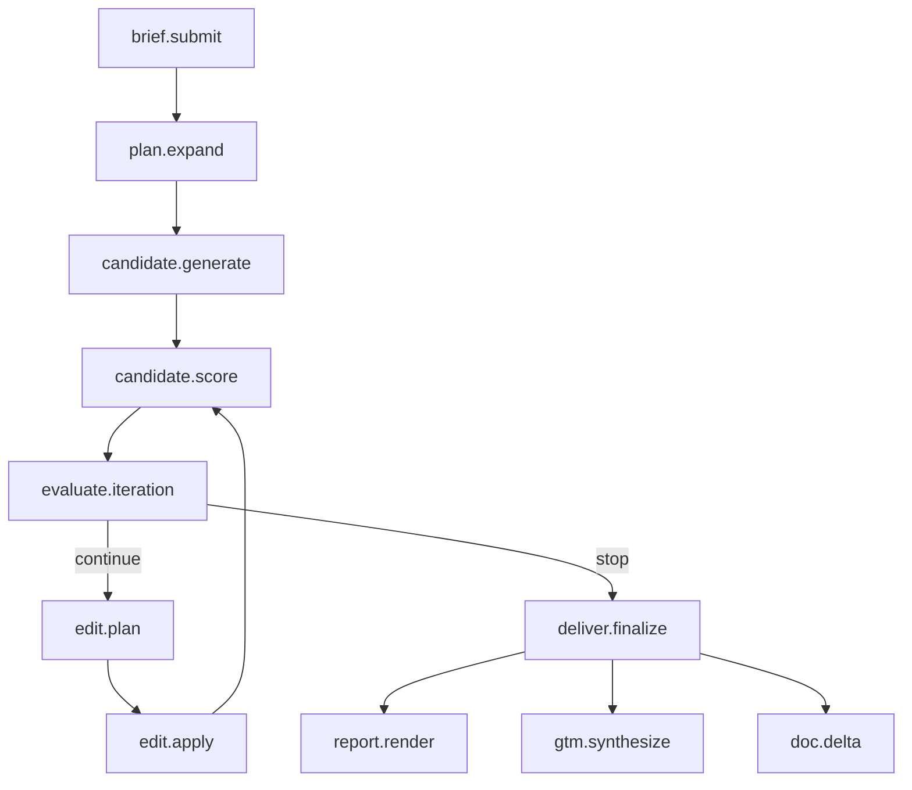

# Orchestrator

The orchestrator is the only piece of net-new code in the Nucleus
engine. Everything else is wired together from existing components.
The orchestrator owns the loop: it reads jobs, expands them into
candidates, dispatches generation and scoring tasks, evaluates results,
decides whether to continue iterating, and delivers final variants.

## Why an orchestrator and not a workflow engine

A handful of obvious alternatives were considered and rejected:

| Alternative | Why not |
|---|---|
| **Temporal** | Operationally heavy. Adds a second job-state store (Temporal's history vs. our Postgres). Worth it for cross-team workflows; overkill for a single-service loop. |
| **Airflow** | Designed for batch ETL on a fixed schedule. Not built for the "thousands of fast-moving short loops in parallel" pattern Nucleus has. |
| **Prefect** | Closer fit than Airflow but still adds infrastructure for observability we already get from our own event log. |
| **LangGraph** | Used in the existing GlassRoom v1 agent and is a good fit for in-process state machines, but doesn't give us multi-worker distribution. |
| **Plain Celery + custom orchestrator** | Chosen. Celery handles task distribution; the orchestrator is ~800 lines of Python that holds the state machine logic. Postgres is the source of truth. |

The trade-off is that we give up the visualization and replay tooling
of a dedicated workflow engine. We make up for it with the structured
[`job_events`](data-model.md#job_events) audit log, which is replayable
and queryable in plain SQL.

## Task graph

Every loop iteration is a sequence of Celery tasks. Each task is a
small function with a known cost ceiling and an idempotent contract.



## Tasks

### `brief.submit`

Entry point. Receives the brief from the API gateway, validates it,
creates a `jobs` row, and enqueues `plan.expand`.

```python
@celery_app.task(
    name="nucleus.brief.submit",
    bind=True,
    autoretry_for=(ValidationError,),
    max_retries=3,
    retry_backoff=True,
)
def brief_submit(self, brief_payload: dict) -> str:
    """
    Idempotent: same payload + same idempotency_key returns the same job_id.
    """
    brief = BriefSchema.validate(brief_payload)
    with db.atomic():
        job = Job.upsert_by_idempotency_key(
            tenant_id=brief.tenant_id,
            idempotency_key=brief.idempotency_key,
            brief=brief.dict(),
        )
        emit_event(job.id, "brief.submitted", {"brief": brief.dict()})
    plan_expand.delay(str(job.id))
    return str(job.id)
```

### `plan.expand`

Expands the brief into the cross-product of candidates. For a brief
with 10 ICPs × 4 languages × 2 archetypes × 3 platforms × 2 variants
per cell, this creates 480 `candidates` rows in a single transaction
and enqueues 480 `candidate.generate` tasks.

```python
@celery_app.task(name="nucleus.plan.expand")
def plan_expand(job_id: str) -> None:
    job = Job.get(job_id)
    cells = expand_cross_product(job.brief)  # → list of CandidateSpec
    with db.atomic():
        candidates = Candidate.bulk_insert(
            [c.to_row(job_id=job.id, tenant_id=job.tenant_id) for c in cells]
        )
        Job.update(job_id, status="generating")
        emit_event(job.id, "plan.expanded", {"candidate_count": len(candidates)})
    for candidate in candidates:
        candidate_generate.apply_async(
            args=[str(candidate.id)],
            queue=queue_for_archetype(candidate.archetype),
        )
```

### `candidate.generate`

Runs the generator agent for one candidate. Reads the Brand KB, picks
relevant source segments, writes a script, calls the appropriate
generation providers, composites the variant, writes the artifact to
S3, creates an `iterations` row with `iteration_index = 0`, and
enqueues `candidate.score`.

```python
@celery_app.task(
    name="nucleus.candidate.generate",
    bind=True,
    autoretry_for=(TransientProviderError,),
    max_retries=4,
    retry_backoff=60,
    retry_jitter=True,
)
def candidate_generate(self, candidate_id: str) -> None:
    candidate = Candidate.get(candidate_id)
    with set_tenant_context(candidate.tenant_id):
        # Existing iterations? This is a retry — find the next index.
        next_index = Iteration.next_index_for(candidate_id)

        agent = GeneratorAgent.for_archetype(candidate.archetype)
        result = agent.generate(
            brief=candidate.brief_slice(),
            brand_kb=candidate.brand_kb,
            source_segments=candidate.source_segments(),
            language=candidate.language,
            icp=candidate.icp,
        )

        artifact_path = upload_to_s3(
            result.video_bytes,
            tenant_id=candidate.tenant_id,
            kind="video",
        )

        iteration = Iteration.create(
            candidate_id=candidate_id,
            iteration_index=next_index,
            artifact_path=artifact_path,
            cost_usd=result.cost_usd,
        )
        emit_event(
            candidate.job_id,
            "candidate.generated",
            {"candidate_id": candidate_id, "iteration_id": str(iteration.id)},
        )
    candidate_score.delay(str(iteration.id))
```

### `candidate.score`

Calls the scoring service (NeuroPeer by default) for the iteration's
artifact. The first iteration of a candidate runs a full score; later
iterations call the [slice-scoring endpoint](../how-it-works.md#continuous-scoring-principle).

```python
@celery_app.task(
    name="nucleus.candidate.score",
    bind=True,
    autoretry_for=(TransientScorerError,),
    max_retries=3,
    retry_backoff=30,
)
def candidate_score(self, iteration_id: str) -> None:
    iteration = Iteration.get(iteration_id)
    candidate = iteration.candidate

    with set_tenant_context(candidate.tenant_id):
        if iteration.iteration_index == 0 or iteration.parent_iteration is None:
            report = analyzer.analyze(
                video_uri=iteration.artifact_path,
                weights=candidate.scoring_weights(),
            )
        else:
            slice_spec = infer_slice_from_edit(iteration.edit_action)
            report = analyzer.analyze_slice(
                video_uri=iteration.artifact_path,
                slice=slice_spec,
                parent=iteration.parent_iteration.score_metrics,
            )

        Iteration.update(
            iteration_id,
            score_composite=report.composite,
            score_metrics=report.metrics,
            score_delta=report.composite - (iteration.parent_iteration.score_composite if iteration.parent_iteration else 0),
        )
        emit_event(
            candidate.job_id,
            "candidate.scored",
            {
                "iteration_id": iteration_id,
                "score": report.composite,
                "delta": report.composite - (iteration.parent_iteration.score_composite if iteration.parent_iteration else 0),
            },
        )
    evaluate_iteration.delay(str(iteration.id))
```

### `evaluate.iteration`

The decision point. Reads the latest score and applies the stop
conditions.

```python
@celery_app.task(name="nucleus.evaluate.iteration")
def evaluate_iteration(iteration_id: str) -> None:
    iteration = Iteration.get(iteration_id)
    candidate = iteration.candidate
    job = candidate.job

    decision = StopConditions.evaluate(
        score_composite=iteration.score_composite,
        score_threshold=job.score_threshold,
        iteration_index=iteration.iteration_index,
        max_iterations=job.max_iterations,
        cost_so_far=candidate.cost_usd,
        cost_ceiling=job.cost_ceiling_usd,
        time_so_far=time_since(candidate.started_at),
        time_ceiling=job.time_ceiling_s,
        delta=iteration.score_delta,
        history=candidate.iteration_history(),
    )

    emit_event(
        job.id,
        "iteration.evaluated",
        {"iteration_id": iteration_id, "decision": decision.name},
    )

    if decision == StopDecision.CONTINUE:
        edit_plan.delay(str(iteration.id))
    else:
        deliver_finalize.delay(str(candidate.id), terminal_reason=decision.name)
```

### `edit.plan`

Calls the editor agent. Reads the score breakdown, picks the edit
primitives expected to move the composite most, and stores an
`EditAction` ready for `edit.apply`.

```python
@celery_app.task(name="nucleus.edit.plan")
def edit_plan(iteration_id: str) -> None:
    iteration = Iteration.get(iteration_id)
    edit_action = EditorAgent().plan(
        candidate=iteration.candidate,
        score_metrics=iteration.score_metrics,
        score_composite=iteration.score_composite,
        target_threshold=iteration.candidate.job.score_threshold,
        history=iteration.candidate.iteration_history(),
    )
    edit_apply.delay(str(iteration.id), edit_action.dict())
```

### `edit.apply`

Applies the edit action — regenerates a slice, swaps a track, rewrites
a line — produces a new artifact, creates a new `iterations` row with
`iteration_index += 1`, and re-enqueues `candidate.score`.

```python
@celery_app.task(
    name="nucleus.edit.apply",
    bind=True,
    autoretry_for=(TransientProviderError,),
    max_retries=3,
)
def edit_apply(self, parent_iteration_id: str, edit_action: dict) -> None:
    parent = Iteration.get(parent_iteration_id)
    new_artifact = EditExecutor.execute(
        parent_artifact=parent.artifact_path,
        edit_action=EditAction(**edit_action),
        candidate=parent.candidate,
    )
    new_iteration = Iteration.create(
        candidate_id=parent.candidate_id,
        iteration_index=parent.iteration_index + 1,
        parent_iteration_id=parent.id,
        edit_action=edit_action,
        artifact_path=new_artifact.path,
        cost_usd=new_artifact.cost_usd,
    )
    candidate_score.delay(str(new_iteration.id))
```

### `deliver.finalize`

Closes out a candidate. Marks it as delivered, computes the final
score, fires `report.render`, and checks whether the parent job has
any candidates still in flight.

```python
@celery_app.task(name="nucleus.deliver.finalize")
def deliver_finalize(candidate_id: str, terminal_reason: str) -> None:
    candidate = Candidate.get(candidate_id)
    final_iteration = candidate.latest_iteration()
    Candidate.update(
        candidate_id,
        status="delivered",
        terminal_reason=terminal_reason,
        final_score=final_iteration.score_composite,
        completed_at=now(),
    )
    UsageEvent.emit(
        tenant_id=candidate.tenant_id,
        job_id=candidate.job_id,
        candidate_id=candidate_id,
        event_type="variant_delivered",
        cost_usd=candidate.cost_usd,
    )
    report_render.delay(str(final_iteration.id))

    if candidate.job.all_candidates_complete():
        gtm_synthesize.delay(str(candidate.job_id))
```

### `report.render` and `gtm.synthesize`

Render the neural report and the GTM strategy guide. These are pure
read-from-DB → render-PDF tasks with no further fan-out.

## Retry policy

Three classes of failure get different retry treatments.

| Failure class | Examples | Retry |
|---|---|---|
| **Transient** | Provider 5xx, network blips, S3 throttle | 3–5 retries with exponential backoff (60s base, 2x multiplier, jitter) |
| **Permanent** | Validation error, invalid brief, deleted KB, billing failure | No retry; emit `*.failed` event; mark candidate failed |
| **Bug** | Unexpected exception | 1 retry to rule out flakiness; if it fails again, emit `*.errored`, capture full traceback to Sentry, mark failed |

Every Celery task has explicit `autoretry_for` lists. The default
behavior is "raise on any unexpected exception" so we never silently
swallow failures.

## Dead-letter queue

Tasks that exhaust their retry budget land in `nucleus.dlq`. The DLQ
is read by a single worker that:

1. Logs the failure to `job_events` with `event_type='task.dlq'`
2. Marks the affected candidate as `failed`
3. Pages the on-call channel if the failure rate exceeds a per-tenant
   threshold over a rolling window
4. Does NOT auto-retry

DLQ entries are inspected manually. The goal is to learn from each one
and either fix the bug or expand the transient-error list.

## Idempotency

Every task is written to be safe under double-execution. Three patterns
do the heavy lifting.

### 1. Idempotency keys for entry points

`brief.submit` accepts an `idempotency_key`. The same key returns the
same `job_id` regardless of how many times the API endpoint is called.
This protects against double-clicks, network retries on the client, and
eager API consumers.

### 2. Index-based deduplication for iterations

`iterations` has a `UNIQUE (candidate_id, iteration_index)` constraint.
If a worker crashes mid-task and the task is retried, the retry checks
for an existing iteration at the next index. If one exists, the retry
uses it instead of creating a duplicate.

### 3. Content-addressed artifacts

S3 artifact paths are hashed on content (or, where we control the
seed, deterministically derived from the brief + parent + edit
action). A retry that re-renders the same content produces the same
artifact path and overwrites cleanly.

## Queue topology

| Queue name | Workers | Backed by | Reason |
|---|---|---|---|
| `nucleus.high` | API-triggered tasks (`brief.submit`, `plan.expand`) | Default Celery worker pool | Low latency required |
| `nucleus.gen.demo` | Demo-archetype generation | CPU workers | Remotion-heavy, no GPU |
| `nucleus.gen.marketing` | Marketing-archetype generation | Mixed workers (GPU for diffusion) | High variability |
| `nucleus.gen.knowledge` | Knowledge-archetype generation | CPU workers | Remotion + Mermaid |
| `nucleus.gen.education` | Education-archetype generation | CPU workers + GPU for Manim | Slow, low priority |
| `nucleus.score` | Scoring | GPU workers (NeuroPeer service) | GPU-bound |
| `nucleus.edit` | Edit planning + apply | Mixed workers | Variable |
| `nucleus.deliver` | Delivery, report rendering, GTM synthesis | CPU workers | I/O bound |
| `nucleus.dlq` | Dead-letter handler | Single worker | Manual inspection |

Queues have independent concurrency limits and independent rate
limits. A spike of education-archetype jobs cannot starve the
high-priority queue.

## Concurrency and fairness

Each tenant gets a per-tenant concurrency cap (default 10 concurrent
candidates). The orchestrator enforces this in `plan.expand`: if a
tenant already has 10 candidates in `generating` or `scoring` state,
new candidates are queued in `pending` and dispatched as old ones
finish.

This is fair-share scheduling, not strict FIFO — a tenant with a 100-
variant job won't block another tenant's 5-variant job from running in
parallel.

## Monitoring

Every task emits OpenTelemetry spans. Key span attributes:

- `nucleus.tenant_id`
- `nucleus.job_id`
- `nucleus.candidate_id`
- `nucleus.iteration_id`
- `nucleus.archetype`
- `nucleus.score_composite`
- `nucleus.cost_usd`

These power the Grafana dashboards described in
[observability](observability.md).
