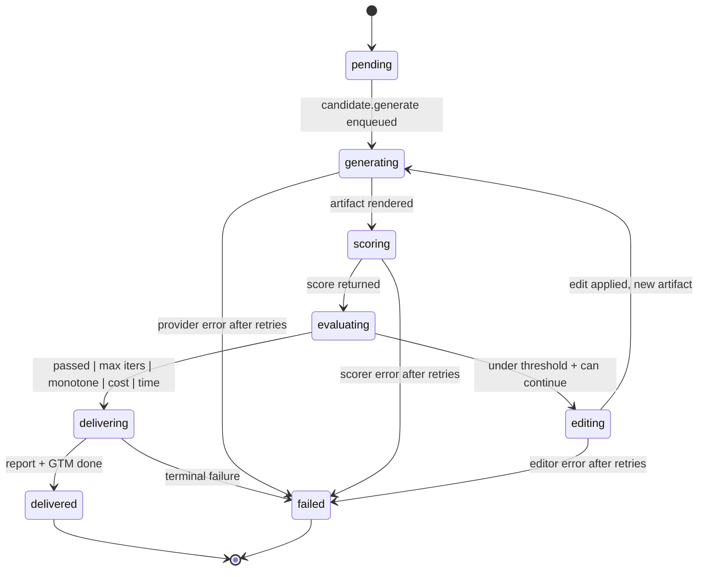
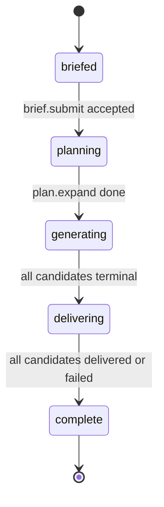

# State Machine

This page is the formal model of the candidate lifecycle. Read it
alongside [orchestrator](orchestrator.md), which is the runtime view.

## Candidate states



## State definitions

| State | What it means | Allowed transitions |
|---|---|---|
| `pending` | Created by `plan.expand`, waiting for a worker | → `generating` |
| `generating` | A worker is executing `candidate.generate` or `edit.apply` | → `scoring`, `failed` |
| `scoring` | A worker is executing `candidate.score` | → `evaluating`, `failed` |
| `evaluating` | The orchestrator is executing `evaluate.iteration` | → `editing`, `delivering` |
| `editing` | A worker is executing `edit.plan` and `edit.apply` | → `generating`, `failed` |
| `delivering` | Final iteration locked; report and GTM rendering | → `delivered`, `failed` |
| `delivered` | Variant ready for the host product | terminal |
| `failed` | Hit a terminal failure; reason in `terminal_reason` | terminal |

## Terminal reasons

When a candidate exits the loop, its `terminal_reason` records why.

| Reason | Trigger | Final state |
|---|---|---|
| `passed_threshold` | Score ≥ threshold | `delivered` |
| `max_iterations` | Iteration count ≥ max | `delivered` (with warning) |
| `monotone_failure` | Score didn't improve in 2 consecutive iterations | `delivered` (with warning) |
| `cost_ceiling` | Per-candidate cost ≥ ceiling | `delivered` (with warning) |
| `time_ceiling` | Wall-clock time ≥ ceiling | `delivered` (with warning) |
| `manual_kill` | User cancelled | `delivered` (with warning) |
| `provider_error` | Generator/avatar/voice/music exhausted retries | `failed` |
| `scorer_error` | Scorer exhausted retries | `failed` |
| `editor_error` | Editor exhausted retries | `failed` |
| `unexpected_error` | Unhandled exception | `failed` |

The first six are "soft stops" — the variant is delivered, but the
neural report includes a warning explaining the early termination.

The last four are "hard failures" — no variant is delivered, the
parent job continues with the remaining candidates, and an alert
fires if the failure rate exceeds threshold.

## Job states

Jobs have a coarser-grained state machine that aggregates over
candidate states.



A job is `complete` when every candidate has reached `delivered` or
`failed`. The `delivering` state is brief — it's the window between
"the last candidate finished" and "the GTM strategist finished".

## Persistence semantics

The state machine lives in the `candidates.status` and `jobs.status`
columns. Every transition is wrapped in a database transaction with
the corresponding `job_events` row written in the same transaction.

```python
def transition_candidate(candidate_id: str, from_state: str, to_state: str, payload: dict) -> None:
    with db.atomic():
        rows = Candidate.update(
            candidate_id,
            where={"status": from_state},  # optimistic lock
            set_={"status": to_state, "updated_at": now()},
        )
        if rows == 0:
            raise ConcurrentTransitionError(...)
        emit_event(
            job_id=candidate_for(candidate_id).job_id,
            candidate_id=candidate_id,
            event_type=f"candidate.{to_state}",
            payload=payload,
        )
```

The optimistic lock prevents two workers from transitioning the same
candidate simultaneously. If a worker tries to move a candidate that's
already moved, the update affects 0 rows and the worker raises a
recoverable error that gets logged but not retried (because the
transition already happened).

## Recovery semantics

When a worker dies mid-task, two things can happen:

### Case 1 — The task hadn't yet written its result

Celery's broker re-queues the task after the visibility timeout. The
retry runs from scratch. Because tasks are idempotent, this is safe:
the task either resumes from where the previous attempt left off (via
the iteration index) or restarts entirely (via the idempotency key).

### Case 2 — The task wrote its result but didn't ack the queue message

Celery re-queues anyway. The retry observes that the result already
exists (e.g., the iteration row exists at the expected index) and
short-circuits.

In both cases, the state machine's invariants hold. A candidate cannot
be in two states at once. An iteration cannot exist twice at the same
index.

## Stuck-state recovery

If a candidate sits in `generating`, `scoring`, or `editing` for
longer than the `time_ceiling_s` setting, a periodic janitor task
escalates it to `failed` with `terminal_reason='unexpected_error'`.

```python
@celery_app.task(name="nucleus.janitor.recover_stuck")
def recover_stuck_candidates() -> None:
    deadline = now() - timedelta(seconds=DEFAULT_STUCK_TIMEOUT_S)
    stuck = Candidate.find_stuck(deadline)
    for c in stuck:
        emit_event(c.job_id, "candidate.stuck", {"candidate_id": c.id})
        Candidate.update(c.id, status="failed", terminal_reason="unexpected_error")
```

The janitor runs every 60 seconds via Celery beat. The
`DEFAULT_STUCK_TIMEOUT_S` is 30 minutes for any single iteration —
generous enough to allow GPU contention, tight enough to avoid wedged
candidates eating worker slots.

## Why this matters for the loop

The state machine is the reason the closed loop is safe to run at
volume. Any iteration can crash, any worker can die, any provider can
return a 5xx — and the candidate either resumes from where it left off
(via idempotent retries) or terminates cleanly into `failed` with a
recoverable audit trail. Nothing wedges. Nothing leaks across tenants.
Nothing returns half-baked output.
