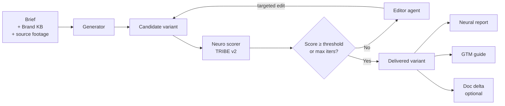
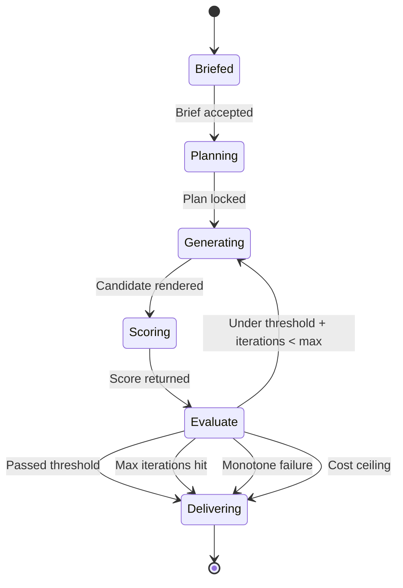
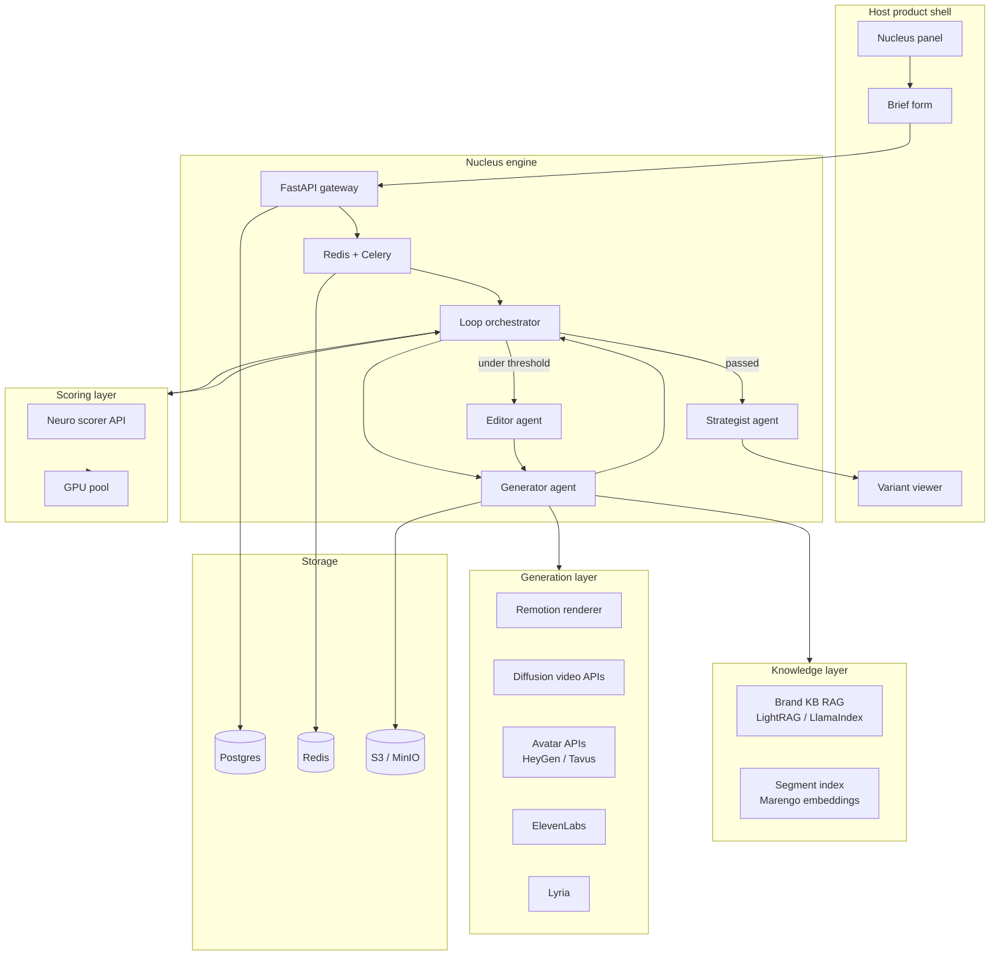

# How It Works

This page is the mechanical view of Nucleus — the loop, the services, the
data flow, and the one optimization that makes the whole thing affordable.
For the feature-level surface, see [features](features.md). For the
business-integration view, see [integration](integration.md).

## The loop



A single Nucleus **job** consumes one brief and produces the cross-product
of variants it asks for. Each variant runs through its own instance of
the loop in parallel.

A **candidate** enters the loop right after the generator emits it and
leaves the loop either by passing threshold or by hitting a stop
condition. Everything between those two events is bounded, retryable,
and persisted to Postgres so a worker crash doesn't lose state.

## The state machine



Each transition is a bounded task. State lives in Postgres; the task
queue is Celery over Redis. The orchestrator is the one net-new service
in the Nucleus codebase — roughly 600–1000 lines of Python that imports
every other component.

## Services at a glance



Every box above that is not labeled "new" already exists in one of the
author's repos. The engineering effort is in the orchestrator, the edit
agent's prompt surface, and the integration layer — everything else is
wired together from working components.

## The loop, step by step

### Step 1 — Brief

The brief is a thin form. Fields: source recording pointer, Brand KB
pointer, list of ICPs, list of languages, list of archetypes, list of
platforms, score threshold, max iterations, variants per cell. The API
accepts the brief, creates a Job row in Postgres, and enqueues the first
task.

### Step 2 — Planning

The orchestrator expands the brief into the full cross-product. For each
cell in `ICP × language × archetype × platform × variant_index`, it
creates a Candidate row in Postgres and enqueues a generation task.
Planning is fast (a few seconds) and deterministic.

### Step 3 — Generation

The generator agent runs per candidate. It:

1. Reads the Brand KB for ICP-relevant context (pain points, positioning,
   tone-of-voice examples, competitor framings)
2. Reads the source footage's segment index to pick the relevant visual
   segments for the script it's about to write
3. Writes an ICP-targeted script in the target language, grounded in the
   Brand KB
4. Assembles the variant through the hybrid generation stack: deterministic
   Remotion composition for known layouts, avatar APIs for talking heads,
   diffusion APIs for atmospheric B-roll, ElevenLabs for voice, Lyria for
   music
5. Writes the rendered variant to S3
6. Enqueues a scoring task

Each of these sub-steps is a bounded operation with a known budget. If
any sub-step fails, the candidate is marked failed and the job continues.

### Step 4 — Scoring

The scoring task calls the neuro scorer API (NeuroPeer by default) with
the variant URL and the brief's scoring weights. The scorer downloads the
video, runs TRIBE v2 inference on GPU, aggregates the 20,484 cortical
vertex predictions into the 18 metric taxonomy, computes the weighted
composite Neural Score, and persists the result.

For the first iteration of a candidate, this is a full score across the
entire video. For subsequent iterations, it's a [slice score](#continuous-scoring-principle)
— much cheaper.

### Step 5 — Evaluate

The orchestrator reads the score and decides:

| Decision | Trigger |
|---|---|
| Continue loop | Score < threshold AND iterations < max AND score improved last 2 iterations AND cost < ceiling AND time < ceiling |
| Stop and deliver | Score ≥ threshold |
| Stop and deliver (warn) | Max iterations hit |
| Stop and escalate | Monotone failure (score didn't improve 2 iterations in a row) |
| Stop and deliver (warn) | Cost ceiling hit |
| Stop and deliver (warn) | Time ceiling hit |

### Step 6 — Edit (if continuing)

The editor agent receives the candidate, its current score breakdown, and
a list of time windows where specific brain regions are under-activating.
It picks one or more of the seven edit primitives:

| Edit primitive | When to fire | Cost class |
|---|---|---|
| Hook rewrite | Hook score low | Medium (regenerate first 2s) |
| Cut tightening | Sustained attention drops | Low (remove a second of footage) |
| Music swap | Emotional resonance low | Low (regenerate music) |
| Pacing change | Cognitive load high | Low (insert breath beat) |
| Narration rewrite | Message clarity low | Low (regenerate a line) |
| Visual substitution | Aesthetic low | Medium (regenerate a B-roll clip) |
| Caption emphasis | Memory encoding low | Low (add emphasis caption) |
| ICP re-anchor | Score fine overall but low for target ICP | Medium (rewrite ICP-specific framing) |

The edit is applied, the variant re-renders, and the loop goes back to
Step 4.

### Step 7 — Deliver

On stop, the variant is marked delivered and three things fire in
parallel:

1. The neural report renderer generates the per-variant report (attention
   curve, brain heatmap, key moments, iteration history)
2. The strategist agent reads all delivered variants from this job and
   emits the GTM strategy guide
3. (Optional) The doc-delta renderer produces an updated SOP fragment
   reflecting the variant's persona framing

All three artifacts are written to S3 and indexed against the parent job.

## Continuous scoring principle

The single most important optimization in the Nucleus engine is that the
neural score is **not** computed once at the end. It's computed
incrementally as the editor operates on the candidate.

When the editor rewrites a 3-second hook, only the first 3 seconds need
to be re-scored. Sustained attention, memory encoding, and aesthetic
quality — metrics that depend on the rest of the video — inherit their
values from the previous iteration. The composite is re-computed from the
updated metric set.

This is implemented as a new endpoint on the scorer service:

```http
POST /api/v1/analyze/slice
Content-Type: application/json

{
  "parent_job_id": "neuropeer_xyz789",
  "url": "s3://nucleus/jobs/abc123/candidate-03-edit-01.mp4",
  "slice": { "start_s": 0, "end_s": 3 },
  "reuse_parent_metrics": ["sustained_attention", "memory", "aesthetic"]
}
```

Without this optimization, per-iteration cost would be the same as
first-iteration cost and the loop would be uneconomical at 100 videos/day.
With it, per-iteration cost drops by roughly 70%, and the loop runs
comfortably at the throughput Nucleus targets.

This is the one net-new feature required from the upstream scorer service.
It's the critical-path engineering item for v1.

## Throughput

Rough capacity model for one candidate, one loop:

| Stage | Compute | Notes |
|---|---|---|
| Script + plan | ~5s | Generator agent call |
| Initial generation | ~60–180s | Remotion compose or avatar render |
| Initial scoring | ~10–30s | Full TRIBE v2 pass on ~30–60s of video |
| Edit planning | ~5s | Editor agent call |
| Re-render after edit | ~20–60s | Remotion re-compose of changed slice |
| Slice re-scoring | ~3–10s | Only the changed slice |
| Loop overhead | ~5s | Queueing, persistence, logs |

Assume 3 average loop iterations per candidate. One candidate end-to-end
is **~5 minutes**. Ten concurrent workers produce **~120 variants per
hour** — a single A100 handles 100 variants/day comfortably during
working hours.

## Cost model

At 100 variants per day, 3 average iterations each:

| Line | Per variant | Daily | Monthly |
|---|---|---|---|
| LLM (generator + editor) | ~$0.02 | $2 | $60 |
| Voice (ElevenLabs) | ~$0.05 | $5 | $150 |
| Music (Lyria) | ~$0.01 | $1 | $30 |
| Diffusion video (where used) | ~$0.40 | $40 | $1,200 |
| Avatar (where used) | ~$0.15 | $15 | $450 |
| GPU scoring (A100 spot, slice-optimized) | ~$0.08 | $8 | $240 |
| Infra baseline | — | ~$5 | $150 |
| **Total** | **~$0.70** | **~$76** | **~$2,280** |

At a $5/variant price point, the engine clears a ~7× gross margin before
any platform-level economies. The full cost analysis (with sensitivity
on diffusion usage, avatar usage, and loop depth) goes into the v1
design doc.

## Pluggable analyzer

The scorer interface is a single Protocol with three concrete
implementations. Nucleus switches between them at config time; the rest
of the engine is unchanged.

```python
# nucleus/analyzer/base.py
class Analyzer(Protocol):
    def analyze(self, video_uri: str, weights: ScoringWeights) -> NeuralReport: ...
    def analyze_slice(
        self,
        video_uri: str,
        slice: TimeSlice,
        parent: NeuralReport,
    ) -> NeuralReport: ...
    def compare(self, reports: list[NeuralReport]) -> ComparisonReport: ...
```

Three implementations:

| Analyzer | Backend | Commercial safety | Precision |
|---|---|---|---|
| `TribeV2Analyzer` (default) | Meta TRIBE v2 via NeuroPeer | CC BY-NC 4.0 — requires a Meta FAIR licensing agreement for commercial deployment | Highest |
| `AttentionProxyAnalyzer` (fallback) | V-JEPA2 features + lightweight trained head for attention + valence | Commercially clean | High |
| `BehavioralProxyAnalyzer` (integration) | Third-party attention-prediction service (Neurons, Realeyes) behind the same interface | Commercial SaaS cost | Medium |

Default is TRIBE v2. The fallback analyzer is a deferred build item in
the [post-meeting plan](POST_MEETING_PLAN.md) — it moves onto the critical
path only if the TRIBE v2 license negotiation stalls.

## What's new versus what's reused

The whole engine is glued together from existing components. The
components Nucleus adds net-new are the orchestrator, the edit agent's
prompt surface and primitive library, the slice-scoring endpoint on the
upstream scorer, and the embed layer for host-product integration.
Everything else — generator framework, Brand KB RAG, segment index,
Remotion renderer, scorer service, avatar APIs, voice, music, design
system, Celery + Redis + Postgres + S3 — is borrowed from repos that
already exist. The detailed reuse map is in the [integration](integration.md)
page because that's where a reviewer is most likely to ask "wait, where
does all of this come from?"
