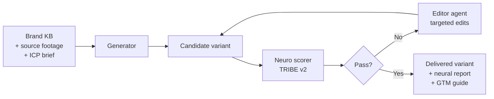

---
hide:
  - navigation
  - toc
---

Recursive neuromarketing video engine

# Brand knowledge in. Neuro-scored video out.

Nucleus turns a brand's documents, screen recordings, and ICP library into
20–100 persona-targeted video variants per day — each one scored by a brain
model, recursively edited until it passes, and delivered with a neural report
and a GTM strategy guide.

[Explore the concept](concept.md){ .md-button } &nbsp;
[See the features](features.md){ .md-button .md-button--secondary }

## What Nucleus does

-   :material-database-search:{ .lg .middle } __Ingests brand knowledge__

    ---

    Point Nucleus at your docs, product copy, ICP library, Brand Kit, and
    existing recordings. It builds a tenant-scoped knowledge base that every
    generated frame is grounded against.

    [:octicons-arrow-right-24: Feature detail](features.md#brand-knowledge-ingestion)

-   :material-multiplication:{ .lg .middle } __Generates at the cross-product__

    ---

    Emits variants across the full ICP × language × platform × archetype
    space. One 60-second input fans out to thousands of targeted candidates;
    the engine keeps only the ones worth delivering.

    [:octicons-arrow-right-24: Feature detail](features.md#persona-variant-generation)

-   :material-brain:{ .lg .middle } __Scores with a brain model__

    ---

    Every candidate runs through a TRIBE v2-class neuro-predictive model
    across 18 metrics — hook strength, sustained attention, emotional
    resonance, memory encoding, aesthetic appeal, cognitive load.

    [:octicons-arrow-right-24: Feature detail](features.md#neuro-predictive-scoring)

-   :material-refresh-auto:{ .lg .middle } __Edits in a closed loop__

    ---

    When a candidate scores below threshold, a dedicated editor agent reads
    the score breakdown, identifies underperforming time slices, and issues
    targeted edits. Re-score. Repeat until the variant passes.

    [:octicons-arrow-right-24: Feature detail](features.md#recursive-edit-loop)

-   :material-chart-timeline-variant:{ .lg .middle } __Delivers neural reports__

    ---

    Every shipped variant comes with per-second attention curves, 3D brain
    activation heatmaps at key moments, and an iteration history showing
    which edits moved the score most. The artifact a CMO can actually read.

    [:octicons-arrow-right-24: Feature detail](features.md#neural-report)

-   :material-compass-outline:{ .lg .middle } __Ships a GTM strategy guide__

    ---

    A strategist agent reads the scored variants and outputs which ICP each
    is best suited for, which platform to post to first, what caption style
    pairs with it, and which variant to A/B against which.

    [:octicons-arrow-right-24: Feature detail](features.md#gtm-strategy-guide)

## The loop, in one picture

The novelty is not the generator and not the scorer — both are commoditizing
fast. The novelty is the closed loop: the score is the reward signal the
editor descends, and every iteration touches only the slices that need
changing, so per-variant cost stays small even at 100 videos per day.

## Why it works now

Three things converged in the last twelve months. Only in early 2026 did all
three become simultaneously true.

-   __TRIBE v2 released__

    ---

    Meta FAIR's tri-modal brain encoding model (d'Ascoli et al., March 2026)
    is the first zero-shot neuro-predictive model for video/audio/text that
    doesn't require recruiting human subjects. Before TRIBE v2, scoring a
    video loop at UGC throughput was financially impossible.

    [:octicons-arrow-right-24: Research foundation](foundation.md#tribe-v2)

-   __Generative video hit production quality__

    ---

    Veo 3.1, Nano Banana Pro, Seedance, Sora 2, Pika 2.2, Luma Ray 3 all
    shipped brand-safe 8-second clips in late 2025. The raw pixels are no
    longer a research artifact.

    [:octicons-arrow-right-24: Feature detail](features.md#hybrid-generation-stack)

-   __Remotion matured__

    ---

    Programmatic React video went from niche to production-ready, which
    means the deterministic composition layer — text overlays, branded
    templating, persona variants — can be code instead of diffusion. Most of
    the composition cost drops to zero.

    [:octicons-arrow-right-24: Feature detail](features.md#deterministic-composition)

## Where to go from here

-   [__Concept__](concept.md) — what Nucleus is and what it's not
-   [__Features__](features.md) — the full capability surface
-   [__How it works__](how-it-works.md) — architecture, loop mechanics, throughput
-   [__Output archetypes__](archetypes.md) — the four classes of variant Nucleus produces
-   [__Research foundation__](foundation.md) — the UGC + neuromarketing literature that grounds the product
-   [__Competitive landscape__](landscape.md) — what incumbents do and don't do
-   [__Integration__](integration.md) — how Nucleus slots into an existing product surface
-   [__Roadmap__](roadmap.md) — MVP, v1, v2

