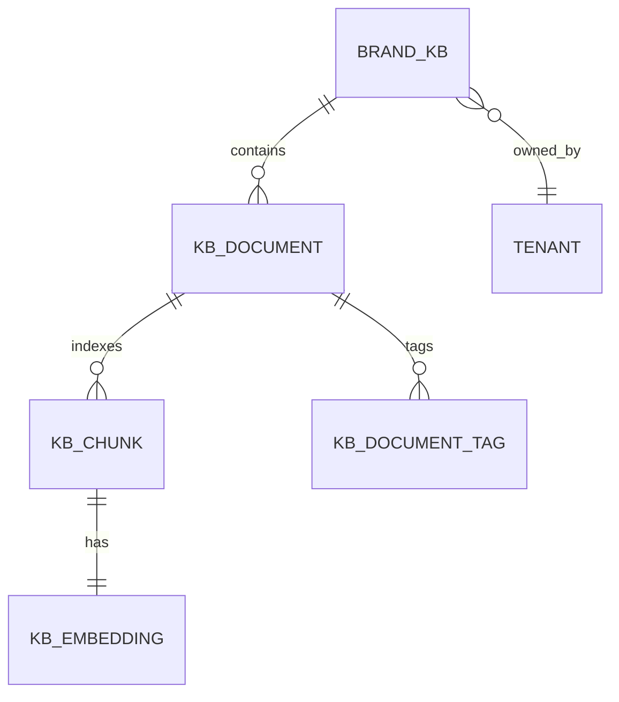

# Brand KB Schema

The Brand KB is built on top of an open-source RAG framework
(LightRAG by default, with LlamaIndex and RAGAnything as
alternatives). This page describes how Nucleus extends the underlying
framework with the metadata and tagging that the generator agent
needs at query time.

## Top-level structure



Each Brand KB is owned by a tenant. Each KB has many documents. Each
document is split into chunks. Each chunk has an embedding. Documents
and chunks both carry metadata tags that the generator uses to filter
retrieval.

## `brand_kbs` table

(Already covered in [data model → brand_kbs](../design/data-model.md#brand_kbs).
Repeated here with the ingestion-specific fields.)

```sql
CREATE TABLE brand_kbs (
    id              UUID PRIMARY KEY DEFAULT gen_random_uuid(),
    tenant_id       UUID NOT NULL REFERENCES tenants(id) ON DELETE CASCADE,
    name            TEXT NOT NULL,
    provider        TEXT NOT NULL,         -- 'lightrag' | 'llamaindex' | 'raganything'
    embedding_model TEXT NOT NULL,         -- e.g. 'text-embedding-3-large' or 'voyage-3'
    embedding_dim   INTEGER NOT NULL,      -- 1024 / 1536 / 3072
    storage_path    TEXT NOT NULL,
    document_count  INTEGER NOT NULL DEFAULT 0,
    chunk_count     INTEGER NOT NULL DEFAULT 0,
    last_indexed_at TIMESTAMPTZ,
    settings        JSONB NOT NULL DEFAULT '{}',
    created_at      TIMESTAMPTZ NOT NULL DEFAULT now()
);
```

`settings` JSONB holds per-KB overrides like chunk size, overlap,
embedding model, retrieval strategy.

## `kb_documents` table

A document is a single source artifact — one PDF, one URL, one
Notion page.

```sql
CREATE TABLE kb_documents (
    id              UUID PRIMARY KEY DEFAULT gen_random_uuid(),
    brand_kb_id     UUID NOT NULL REFERENCES brand_kbs(id) ON DELETE CASCADE,
    source_type     TEXT NOT NULL,         -- 'pdf' | 'markdown' | 'url' | 'notion' | 'confluence' | 'drive' | 'mcp'
    source_uri      TEXT NOT NULL,
    sha256          TEXT NOT NULL,
    title           TEXT,
    language        TEXT,
    icp_tags        TEXT[],
    pain_tags       TEXT[],
    archetype_tags  TEXT[],                -- which archetypes this document is best for
    freshness_at    TIMESTAMPTZ,
    char_count      INTEGER,
    storage_path    TEXT NOT NULL,         -- S3 path to the raw file
    created_at      TIMESTAMPTZ NOT NULL DEFAULT now(),
    UNIQUE (brand_kb_id, sha256)
);

CREATE INDEX idx_kb_documents_kb ON kb_documents(brand_kb_id);
CREATE INDEX idx_kb_documents_icp_tags ON kb_documents USING GIN (icp_tags);
CREATE INDEX idx_kb_documents_pain_tags ON kb_documents USING GIN (pain_tags);
CREATE INDEX idx_kb_documents_archetype_tags ON kb_documents USING GIN (archetype_tags);
```

The `icp_tags`, `pain_tags`, and `archetype_tags` are populated
during ingestion by an LLM tagger that reads the document and
classifies it against the tenant's ICP library and pain-point
taxonomy.

## `kb_chunks` table

Chunks are smaller units (typically 500–1500 tokens) used for
embedding and retrieval.

```sql
CREATE TABLE kb_chunks (
    id              UUID PRIMARY KEY DEFAULT gen_random_uuid(),
    document_id     UUID NOT NULL REFERENCES kb_documents(id) ON DELETE CASCADE,
    chunk_index     INTEGER NOT NULL,
    content         TEXT NOT NULL,
    embedding       VECTOR(1024),          -- pgvector, dimension matches kb.embedding_dim
    semantic_tags   TEXT[],
    char_count      INTEGER,
    UNIQUE (document_id, chunk_index)
);

CREATE INDEX idx_kb_chunks_document ON kb_chunks(document_id);
CREATE INDEX idx_kb_chunks_embedding ON kb_chunks USING ivfflat (embedding vector_cosine_ops);
```

Chunks inherit their parent document's tags transitively at query
time but can also carry their own tags if the chunker identifies
distinct semantic regions inside a document.

## Chunking strategy

Default chunking: **semantic-first with token-budget fallback.**

```python
def chunk_document(text: str, max_tokens: int = 1024, overlap_tokens: int = 128) -> list[Chunk]:
    """
    Try to split on semantic boundaries (paragraph, section, list item).
    Fall back to a sliding window with overlap when a semantic chunk
    exceeds the token budget.
    """
    semantic_chunks = split_on_semantic_boundaries(text)
    final_chunks = []
    for chunk in semantic_chunks:
        if count_tokens(chunk) <= max_tokens:
            final_chunks.append(chunk)
        else:
            final_chunks.extend(sliding_window(chunk, max_tokens, overlap_tokens))
    return final_chunks
```

The semantic-first approach matters more for blog posts and ICP
documents (which have natural section breaks) than for support
tickets (which are usually short enough to be a single chunk).

## Embedding model

The default embedding model is `voyage-3` (Voyage AI's general-
purpose model), which produces 1024-dimensional vectors. Two reasons:

1. **Cost.** $0.06 per 1M tokens vs $0.13 for OpenAI's
   `text-embedding-3-large`.
2. **Quality.** Voyage-3 currently leads the MTEB English retrieval
   benchmark.

Alternatives configurable per-KB:

| Model | Dimension | Cost / 1M tokens | Use |
|---|---|---|---|
| `voyage-3` | 1024 | $0.06 | Default |
| `voyage-3-large` | 1024 | $0.18 | Higher quality, longer documents |
| `text-embedding-3-large` (OpenAI) | 3072 | $0.13 | OpenAI ecosystem |
| `text-embedding-3-small` (OpenAI) | 1536 | $0.02 | Cost-optimized |
| `bge-large-en-v1.5` (BAAI) | 1024 | Self-host | Self-host fallback |
| `gte-large-en-v1.5` (Alibaba) | 1024 | Self-host | Self-host alternative |

The embedding model is locked at KB creation. Changing it requires
re-embedding the entire KB, which is expensive. Tenants can create a
new KB with a different embedding model and migrate over.

## Tagging

Every document gets three classes of tags during ingestion:

### ICP tags

The tagger reads the document and matches it against the tenant's
existing ICP library. Tags are ICP names from `icp_personas` table.

```python
icp_tags = ICPTagger.tag(
    document_text=doc.content,
    tenant_icps=tenant.icp_personas,  # list of ICPPersona
)
# → ['Head of Sales Enablement', 'CSM at SaaS', 'IT Director']
```

ICP tags are used at query time to filter retrieval to documents
relevant to the variant's target persona.

### Pain tags

The tagger identifies the pain points the document addresses and
matches them against the tenant's pain-point taxonomy.

```python
pain_tags = PainTagger.tag(
    document_text=doc.content,
    pain_taxonomy=tenant.pain_taxonomy,  # list of PainPoint
)
# → ['re_record_on_update', 'localization_friction', 'demo_personalization']
```

The pain taxonomy is per-tenant. For TruPeer customers, the default
taxonomy comes from TruPeer's own pain-point clusters (re-record on
update, localization friction, personalization at scale, etc.).

### Archetype tags

The tagger classifies which Nucleus archetype the document is best
suited for as source material.

```python
archetype_tags = ArchetypeTagger.tag(
    document_text=doc.content,
)
# → ['demo', 'knowledge']
```

A blog post explaining a technical feature might get
`['knowledge', 'education']`. A case study might get
`['marketing', 'demo']`. A pricing page might get `['marketing']`.

The tagger is a small LLM call (Sonnet or GPT-4o-mini) with a
structured-output schema and runs once per document at ingestion
time. It's cached so re-ingesting an unchanged document doesn't
re-tag.

## Knowledge graph layer (optional)

LightRAG, the default RAG provider, builds a knowledge graph
alongside the vector index. The KG captures relationships between
entities (product features, ICPs, pain points, customer names) that
plain vector retrieval misses.

For tenants on the Growth and Enterprise tiers, the knowledge graph
is enabled by default. Starter-tier tenants get vector-only
retrieval to keep costs down.

## Storage layout

```
/data/nucleus/brand-kbs/{tenant_id}/{brand_kb_id}/
    raw/
        {document_id}/{filename}        # original uploaded file
    chunks/
        {document_id}.json              # serialized chunks for re-embedding
    embeddings/
        index.faiss                     # FAISS index for fast retrieval
        index.pkl                       # metadata sidecar
    knowledge_graph/                    # LightRAG KG store
        nodes.parquet
        edges.parquet
    metadata.json                       # KB-level config
```

The directory is per-tenant per-KB. Backups, cleanup, and tenant
deletion all operate at the directory level.

## Multi-language KBs

A single Brand KB can hold documents in multiple languages. The
embedding model handles cross-lingual retrieval reasonably well for
the major languages (English, Spanish, French, German, Portuguese,
Japanese, Mandarin, Arabic). For tenants targeting niche languages
where embedding quality degrades, the recommended pattern is one
KB per language family.

## What's not in the schema

- **Versioning.** Documents are content-hashed, so an updated
  document creates a new row. The old row stays for audit purposes
  but is excluded from retrieval. Full version history is in
  `kb_documents` over time.
- **User comments / annotations.** The KB is read-only for the
  generator agent. A future product surface could let humans annotate
  documents with "this is good Nucleus context" / "this is bad" but
  it's not in the v1 schema.
- **Cross-tenant sharing.** Brand KBs are strictly tenant-scoped.
  No "global" or "shared" KB primitive.
