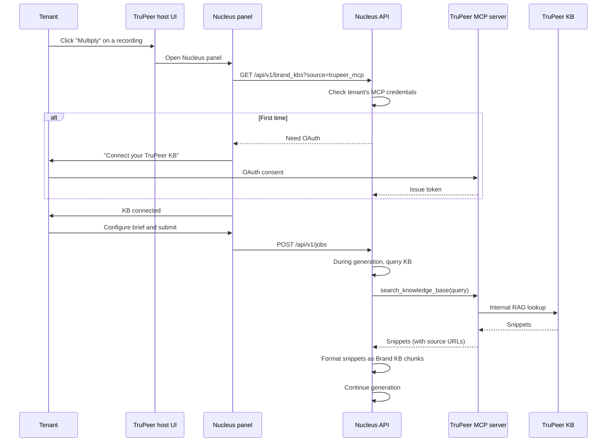

# MCP Integration

TruPeer ships an MCP (Model Context Protocol) server at
`https://api.trupeer.ai/mcp` that exposes a customer's existing
TruPeer knowledge base as queryable tools. Nucleus's MCP connector
uses this server to bootstrap a Brand KB for any TruPeer customer
without re-uploading documents.

This page describes how the integration works, what data flows where,
and what the connector handles automatically vs. what the tenant must
configure.

## What MCP is

[Model Context Protocol](https://modelcontextprotocol.io) is an open
specification (originally introduced by Anthropic) for LLMs and
agents to call external tools over a standardized JSON-RPC interface.
It's becoming the de-facto standard for plugging external knowledge
into AI agents.

TruPeer's MCP server exposes two tools:

| Tool | Signature | Purpose |
|---|---|---|
| `search_knowledge_base(query: str)` | Returns a list of document snippets | Semantic search over the tenant's TruPeer KB |
| `answer_query_from_knowledge_base(query: str)` | Returns a synthesized answer | Higher-level RAG (calls the search tool internally) |

The Nucleus connector uses `search_knowledge_base` directly because
it wants the raw snippets, not a synthesized answer. The synthesized
answer tool is reserved for cases where Nucleus is asking the
TruPeer KB an actual question on behalf of the user (a future
feature).

## Why this matters

Three reasons.

### 1. Zero-touch bootstrap for TruPeer customers

A TruPeer customer who has already populated their TruPeer KB gets a
usable Nucleus Brand KB **without uploading anything**. The Nucleus
panel inside TruPeer detects the customer's existing KB, walks them
through OAuth, and starts ingesting on the first variant generation.

The customer's first variant lands in ~5 minutes because the KB is
already there.

### 2. Inherited curation

A TruPeer customer's KB is already curated for their use cases. The
documents are tagged, organized, and current — because the customer
has been maintaining them. Nucleus inherits all of that curation
without re-doing it.

### 3. Live freshness

When a TruPeer customer updates their KB, Nucleus's next query sees
the update. There's no separate "refresh Nucleus" step.

## How the connector works



## OAuth flow

The first time a tenant uses the MCP connector, they go through an
OAuth handshake:

1. Nucleus surface "Connect TruPeer KB" button
2. Tenant clicks → redirected to TruPeer's OAuth consent screen
3. Tenant approves the `mcp:read` scope
4. TruPeer redirects back to Nucleus with an authorization code
5. Nucleus exchanges the code for an access token + refresh token
6. Tokens stored encrypted in Nucleus's secret manager, indexed by
   tenant ID

The tokens are scoped to read-only KB access. Nucleus cannot modify
the TruPeer KB; it can only query it.

## Sync strategy

Unlike other connectors that pull documents into Nucleus's own
storage, the MCP connector queries the TruPeer KB **on demand**
during generation. Two consequences:

1. **No local storage of TruPeer KB content.** Nucleus doesn't hold a
   copy of the customer's KB. Every retrieval hits TruPeer's MCP
   server.
2. **Latency dependent on TruPeer's MCP latency.** TruPeer's MCP
   server is the bottleneck. Nucleus caches results aggressively
   (1-hour TTL) to compensate.

The trade-off: data residency stays inside TruPeer, but every query
is a network hop. For tenants who want lower latency or who want
their KB content held by Nucleus directly, the alternative is to
configure a Notion / Confluence / Drive connector pointing at the
same content.

## Caching

MCP query results are cached per `(tenant_id, query_hash)` for 1
hour in Redis. Cache hit rate is high (60-80%) because variant
generation reuses similar context across an ICP × language fan-out.

```python
async def query_mcp_with_cache(tenant_id: str, query: str) -> list[Snippet]:
    cache_key = f"nucleus:{tenant_id}:mcp:{sha256(query)}"
    cached = await redis.get(cache_key)
    if cached:
        return json.loads(cached)
    snippets = await mcp_client.search(query)
    await redis.setex(cache_key, 3600, json.dumps(snippets))
    return snippets
```

## Failure modes

| Failure | Impact | Mitigation |
|---|---|---|
| TruPeer MCP server returns 503 | Generation fails on this variant | Cache + retry with backoff; fall back to other connectors if available |
| OAuth token expired | First query fails | Refresh-token flow; if refresh fails, prompt tenant to re-authorize |
| TruPeer rate limits Nucleus | Query latency increases | Per-tenant query throttle on Nucleus side |
| TruPeer MCP schema changes | Connector breaks | Version the MCP API; coordinate with TruPeer engineering on changes |
| Tenant doesn't have a TruPeer KB | Bootstrap fails | Fall back to ingesting TruPeer recording transcripts as KB documents |

The MCP connector is treated as one connector among many. If it
fails, the tenant can fall back to manual upload, URL crawl, or
direct Notion/Confluence integration.

## Security

The MCP integration treats TruPeer as a trusted sub-processor:

- All traffic is TLS 1.3
- Tokens are stored encrypted with the tenant ID as the encryption
  key derivation input
- Every MCP query is logged with `tenant_id` and `query` (not the
  response — that would leak content into logs)
- Rate limits prevent any tenant from exhausting the shared TruPeer
  MCP quota
- Nucleus never proxies the MCP server to other tenants

## When NOT to use the MCP connector

The MCP connector is great for TruPeer customers with mature TruPeer
KBs. It's the wrong choice when:

- The tenant's brand content lives outside TruPeer (use Notion /
  Confluence / Drive connectors instead)
- The tenant wants to control freshness more tightly (a direct
  connector with explicit cache invalidation is better)
- The tenant is concerned about per-query latency (manual upload
  loads the content into Nucleus's local store, which is faster)

These are configuration decisions, not architectural ones. A tenant
can switch from MCP to direct ingestion at any time without losing
existing variants.

## Outside TruPeer

The MCP connector pattern generalizes to any host product that
exposes an MCP server. If a future host product (e.g., a B2B
sales-enablement platform) ships its own MCP server, Nucleus can
add a corresponding connector with minimal new code.

The MCP-host integration is a clean architectural pattern for
"plug Nucleus into a host product without copying the host's
content." TruPeer is the first; others can follow.
