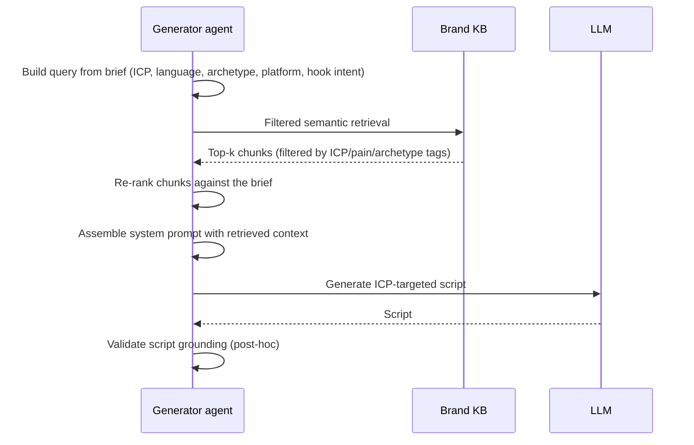

# RAG Query Pattern

The Brand KB is queried by the generator agent at every variant
generation. This page describes the query pattern — what gets
retrieved, how it's filtered, how it's assembled into the prompt,
and how the agent uses it.

## The query at a glance



## Step 1 — Build the query

The generator builds a structured query from the brief, not just a
raw embedding lookup. The query has multiple components:

```python
@dataclass
class KBQuery:
    intent: str                    # 'hook' | 'body' | 'cta' | 'transition'
    icp: ICPPersona
    language: str
    archetype: str                 # 'demo' | 'marketing' | 'knowledge' | 'education'
    platform: str
    keywords: list[str]            # explicit keywords from the brief
    semantic_query: str            # the actual text the embedding model sees
```

The `semantic_query` is constructed from the intent + ICP + keywords.
For a marketing-archetype hook generation:

```python
semantic_query = (
    f"hook for {icp.role} at {icp.company_type}, "
    f"pain point: {keywords[0]}, "
    f"target language: {language}"
)
```

For a knowledge-archetype body section:

```python
semantic_query = (
    f"explain {keywords[0]} for {icp.seniority} {icp.role}, "
    f"focus on practical application, "
    f"reference brand voice from existing customer education content"
)
```

The structured query format makes the retrieval predictable and
debuggable.

## Step 2 — Filter retrieval

The filter step reduces the candidate set before the embedding
search. Filters are SQL WHERE clauses against the document tags:

```sql
SELECT id FROM kb_documents
WHERE brand_kb_id = $1
  AND (icp_tags && $2 OR icp_tags = '{}')          -- match this ICP or untagged
  AND (archetype_tags && $3 OR archetype_tags = '{}') -- match this archetype or untagged
  AND (language IS NULL OR language = $4 OR language = 'en')
ORDER BY freshness_at DESC NULLS LAST
LIMIT 100;
```

Untagged documents fall through (`icp_tags = '{}'`) so a generic
"about us" page is still retrievable for any ICP query.

## Step 3 — Semantic retrieval

Within the filtered candidate set, the embedding model finds the top
chunks by cosine similarity:

```python
query_embedding = embed(query.semantic_query)

results = db.execute(
    """
    SELECT
      kc.id,
      kc.content,
      kc.embedding <=> $1 AS distance,
      kd.title,
      kd.source_uri,
      kd.icp_tags,
      kd.pain_tags
    FROM kb_chunks kc
    JOIN kb_documents kd ON kc.document_id = kd.id
    WHERE kd.id = ANY($2)
    ORDER BY distance
    LIMIT $3
    """,
    [query_embedding, candidate_doc_ids, top_k],
)
```

`top_k` defaults to 12. The generator can request more for complex
queries (education archetype) or fewer for simple ones (hook
generation).

## Step 4 — Re-rank

The retrieved chunks are re-ranked against the structured query
using a small reranker model (`bge-reranker-v2-m3` by default,
self-hosted on CPU). Re-ranking matters because cosine similarity
on embeddings is approximate; the reranker uses a cross-encoder
that produces more accurate similarity scores at the cost of more
compute per pair.

```python
reranked = reranker.rerank(
    query=query.semantic_query,
    documents=[r.content for r in results],
    top_n=8,  # keep the top 8 after reranking
)
```

The reranker reduces the top-12 to top-8, but the top-8 are more
relevant than the top-8 the embedding model would have returned
directly.

## Step 5 — Assemble the prompt

The reranked chunks become context in the system prompt:

```python
system_prompt = f"""
You are writing a {query.archetype}-archetype variant for {query.icp.name}.

The target persona:
{query.icp.to_prompt()}

The target language: {query.language}
The target platform: {query.platform}

Brand context (cite these where relevant):
{format_chunks_for_prompt(reranked)}

Brand voice guidance:
{tenant.brand_voice_guidelines}

Generate a {query.intent} that:
- Uses the brand's actual language from the context above
- Speaks directly to the target persona's pain points
- Follows the brand voice guidelines
- Is appropriate for the target platform's format
"""
```

The chunks are formatted with attribution so the LLM can cite which
context it's drawing from:

```
[Context 1] (from "Acme Customer Success Story", https://acme.com/case-studies/widgets)
"Widgets reduced our deployment time from 3 weeks to 2 days..."

[Context 2] (from "Why Acme exists", https://acme.com/about)
"We started Acme because the existing widget tooling..."

[Context 3] (from "Pricing FAQ", https://acme.com/pricing)
"Our Growth tier includes..."
```

## Step 6 — Validate grounding (post-hoc)

After the LLM produces a script, a small validator runs to check
that the script is actually grounded in the retrieved context:

```python
def validate_grounding(script: str, contexts: list[Chunk]) -> GroundingReport:
    """
    For each non-trivial claim in the script, find the closest matching
    chunk. If the closest chunk's similarity is below threshold, flag
    the claim as ungrounded.
    """
    claims = extract_claims(script)
    ungrounded = []
    for claim in claims:
        best_match = max(contexts, key=lambda c: cosine(embed(claim), c.embedding))
        if cosine(embed(claim), best_match.embedding) < GROUNDING_THRESHOLD:
            ungrounded.append((claim, best_match))
    return GroundingReport(claims=claims, ungrounded=ungrounded)
```

If grounding score is too low, the iteration is tagged with a
warning and the editor agent is encouraged to rewrite the
ungrounded claims using the retrieved context.

## Why this is more than vanilla RAG

Three differences from a default RAG implementation:

1. **Structured query.** The generator builds a typed query object
   instead of dumping the brief into an embedding model. This makes
   retrieval reproducible and debuggable.
2. **Tag-filtered retrieval.** Filtering by ICP / archetype tags
   before semantic search dramatically improves precision. A
   marketing variant for "Head of Sales" doesn't get noise from
   training-doc chunks tagged for L&D.
3. **Post-hoc grounding validation.** The generator doesn't trust
   the LLM to stay grounded. The validation step catches
   hallucinations before they ship.

## Cost per query

| Component | Cost |
|---|---|
| Query embedding (1 call to Voyage-3) | < $0.0001 |
| SQL filter | < $0.0001 (Postgres-local) |
| Vector retrieval (top-12) | < $0.0001 (Postgres pgvector) |
| Reranker (CPU) | ~$0.001 |
| Context assembly | $0 (in-process) |
| **Total per query** | **< $0.002** |

A typical variant generation makes 3–5 KB queries (one per script
section). Total KB cost per variant is < $0.01.

## Caching

KB queries are cached per (tenant, query hash) for 1 hour. The cache
is in Redis. Hit rate is typically 10–20% — most queries are unique
because they include the variant index and ICP combination, but
common queries (e.g., "brand voice guidance") hit the cache often.

## What this pattern doesn't do

- **Cross-document reasoning.** A single query retrieves chunks; it
  doesn't reason across multiple documents to build a synthesis.
  For that, the [research pipeline](research-pipeline.md) (used by
  the education archetype) wraps multi-step retrieval with an
  agent loop.
- **Image-grounded retrieval.** Chunks are text only. Images in
  source documents are discarded.
- **Time-aware retrieval.** "What does the brand say about X today
  vs. 6 months ago?" requires comparing document freshness manually.
  Not a v1 feature.
- **Negative retrieval.** "Don't say things like X." Currently
  enforced by brand voice guidelines in the system prompt, not by
  retrieval.
