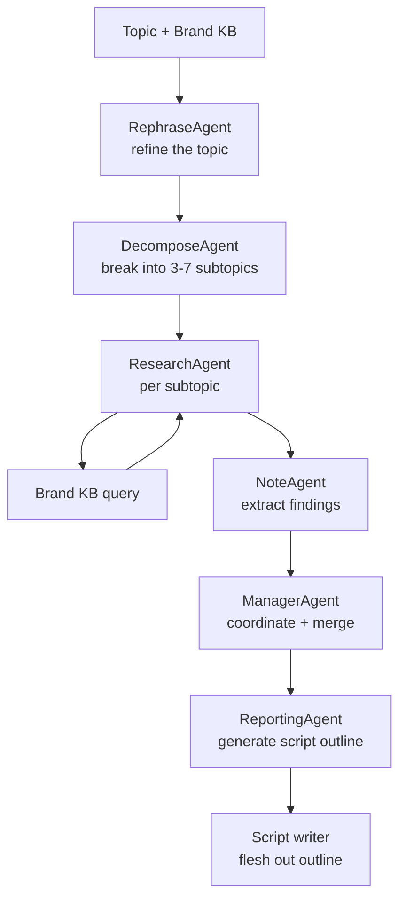

# Research Pipeline

The education archetype is the only Nucleus archetype that needs
multi-step research over the Brand KB before scripting. A 10-minute
explainer on a complex topic can't be assembled from a single RAG
query — it needs an outline, supporting evidence per section, and a
synthesis pass that turns the outline into a coherent script.

This is what the research pipeline does. It's powered by DeepTutor's
existing multi-agent research framework, adapted to read from a
Brand KB instead of a generic document set.

## When the research pipeline runs

| Archetype | Research pipeline? |
|---|---|
| Demo | No — single RAG query is enough |
| Marketing | No — hook + body + CTA each get one query |
| Knowledge | No — segment selection + script rewrite is enough |
| Education | **Yes** — outline → per-section research → synthesis |

The research pipeline is the most expensive component in the
generation stack. It only runs for variants that explicitly need
deep synthesis.

## Multi-agent architecture



Each agent is a small LLM call with a specific role. The
orchestration is taken from DeepTutor's
`src/agents/research/research_pipeline.py`.

## Step 1 — Rephrase

The `RephraseAgent` takes the brief's topic and refines it into a
research question:

> Brief topic: "Explain how Acme Widgets reduce deployment time"
>
> Refined research question: "What are the specific mechanisms by
> which Acme Widgets reduce deployment time, what evidence supports
> this claim, who has benefited, and what are the relevant
> objections from skeptical customers?"

The refinement makes the downstream decomposition more productive.

## Step 2 — Decompose

The `DecomposeAgent` breaks the research question into 3–7 subtopics:

> Subtopics:
> 1. The mechanisms — what specifically Widgets do that's faster
> 2. The customer evidence — case studies and testimonials
> 3. The technical foundation — why the mechanisms work
> 4. The comparison baseline — what the alternatives look like
> 5. The objections — why skeptics push back and how to respond
> 6. The pricing context — when Widgets are cost-effective

Subtopics become the section structure of the eventual script.

## Step 3 — Research per subtopic

For each subtopic, the `ResearchAgent` runs a targeted retrieval
pass against the Brand KB:

```python
async def research_subtopic(subtopic: str, brand_kb: BrandKB) -> Findings:
    queries = await query_planner.plan(subtopic, n_queries=3)
    all_chunks = []
    for q in queries:
        chunks = await brand_kb.semantic_search(q, top_k=8)
        all_chunks.extend(chunks)
    deduped = dedupe_chunks(all_chunks)
    findings = await synthesizer.synthesize(subtopic, deduped)
    return findings
```

The `query_planner` generates 3 sub-queries per subtopic to cover
the angle from multiple framings. The synthesizer reads the
retrieved chunks and produces a structured `Findings` object with
key claims and supporting quotes.

## Step 4 — Note-taking

The `NoteAgent` reads each subtopic's findings and extracts the
load-bearing facts into a structured note set:

```python
@dataclass
class Note:
    fact: str
    source_chunks: list[ChunkRef]
    confidence: float
    relevance_to_main_question: float
```

Notes are deduplicated across subtopics so the final synthesis
doesn't repeat the same fact in two sections.

## Step 5 — Manager coordination

The `ManagerAgent` reads all subtopic findings and decides:

- Which subtopics have enough evidence to justify a section
- Which subtopics should be merged
- Which subtopics should be dropped
- The final section ordering

This is where the research pipeline pruning happens. A subtopic
with weak evidence gets dropped or merged with a neighbor.

## Step 6 — Script outline

The `ReportingAgent` produces a structured script outline:

```yaml
title: "How Acme Widgets reduce deployment time"
estimated_duration_s: 600
sections:
  - section: "Hook"
    duration_s: 15
    content: "Open with the time-to-deployment problem most teams face"
    sources: [chunk_ids]

  - section: "Mechanism 1: Pre-built templates"
    duration_s: 90
    content: "Explain how Widgets ship with pre-built deployment templates..."
    sources: [chunk_ids]
    visualizations: ["mermaid_flow_template_to_deploy"]

  - section: "Mechanism 2: Automated dependency resolution"
    duration_s: 90
    content: "..."
    sources: [chunk_ids]
    visualizations: ["mermaid_dep_graph"]

  - section: "Customer evidence: Glean case study"
    duration_s: 60
    content: "Glean reduced deployment from 3 weeks to 2 days..."
    sources: [chunk_ids]
    quote: "[direct customer quote with attribution]"

  - section: "Comparison baseline"
    duration_s: 60
    content: "..."

  - section: "Common objections + responses"
    duration_s: 90
    content: "..."

  - section: "When Widgets are cost-effective"
    duration_s: 60
    content: "..."

  - section: "CTA"
    duration_s: 30
    content: "Try Widgets for 14 days..."
```

The outline is the contract between the research pipeline and the
script writer. Each section has a specific duration target, a
content description, source chunks for grounding, and any
visualizations needed.

## Step 7 — Script generation

The script writer is a separate agent that takes the outline and
produces the full script:

```python
async def write_script(outline: Outline, brand_voice: BrandVoice) -> Script:
    sections = []
    for outline_section in outline.sections:
        section_text = await section_writer.write(
            target_duration_s=outline_section.duration_s,
            content_brief=outline_section.content,
            source_chunks=outline_section.sources,
            brand_voice=brand_voice,
            previous_sections=sections,  # for narrative coherence
        )
        sections.append(section_text)
    return Script(sections=sections)
```

The section writer takes care of:

- Hitting the target duration (controlled by word count and
  speaking rate estimates)
- Citing source chunks for any factual claims
- Maintaining narrative coherence with previous sections
- Following the brand voice guidelines

## Cost per education-archetype variant

A typical 10-minute education variant runs through the research
pipeline once and produces 7-10 sections. Cost breakdown:

| Component | Calls | Per call | Total |
|---|---|---|---|
| Rephrase | 1 | $0.005 | $0.005 |
| Decompose | 1 | $0.005 | $0.005 |
| Research per subtopic | 7 × 3 sub-queries | $0.002 each | $0.042 |
| Synthesize per subtopic | 7 | $0.010 | $0.070 |
| Note-taking | 7 | $0.005 | $0.035 |
| Manager coordination | 1 | $0.010 | $0.010 |
| Reporting | 1 | $0.015 | $0.015 |
| Section writing | 7-10 | $0.020 | $0.140-$0.200 |
| **Total** | **~30 calls** | — | **~$0.32** |

This is the dominant cost line for education-archetype variants.
It's expensive enough that only the education archetype runs the
full research pipeline.

## When the research pipeline can be skipped

For knowledge-archetype variants that touch a topic the Brand KB
already has a single canonical document for (e.g., "explain feature
X" where the Brand KB has "feature X documentation"), the research
pipeline is overkill. The knowledge-archetype generator does a
direct RAG query instead.

The trigger for the research pipeline is **topic complexity**, not
archetype. A complex knowledge variant can opt into the research
pipeline; a simple education variant can opt out. The default
behavior matches archetype, but the brief can override.

## What this pipeline doesn't do

- **External web search.** The pipeline only reads from the Brand
  KB. If a topic requires information not in the KB, the variant is
  flagged as `kb_miss` and the customer is told to add documents.
  Web search is a future feature.
- **Citation linking.** The pipeline tracks source chunks
  internally but doesn't render clickable citations in the variant
  itself. Reports do show citations.
- **Multi-document reasoning beyond synthesis.** The pipeline
  synthesizes within a subtopic; it doesn't do multi-hop reasoning
  across subtopics. For most marketing/training use cases this is
  fine.
- **Fact-checking.** The pipeline trusts the Brand KB's content. If
  the brand's own documents contain errors, the variant will
  faithfully reproduce them.
