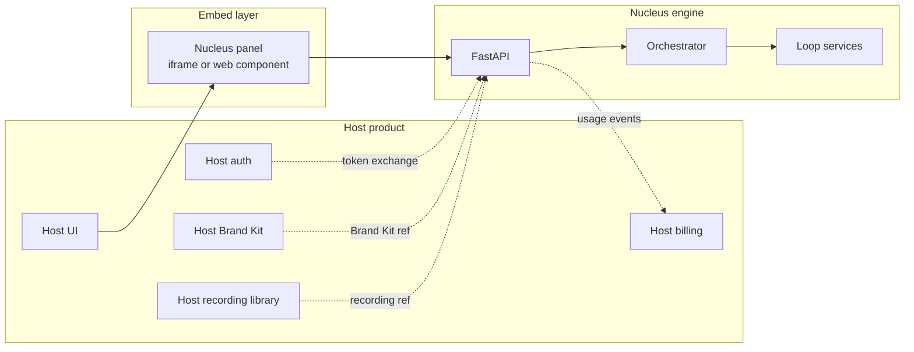

# Integration

Nucleus is designed to live inside an existing brand-facing product
rather than stand alone. This page describes how the engine embeds, what
the host product surface sees, and how the reuse map pulls from existing
services so that the engineering cost of shipping Nucleus into a host
product is measured in weeks, not quarters.

## The integration pattern

Nucleus exposes a headless engine behind a clean HTTP/WebSocket surface.
The host product owns the customer relationship, the billing, the
auth, and the shell UI. Nucleus owns the generator, scorer, editor,
orchestrator, and report renderer. The boundary between the two is a
single REST + WebSocket contract.

Three properties make the integration clean:

1. **Nucleus reads, doesn't copy.** The Brand Kit, recordings, and ICP
   library live in the host product. Nucleus holds pointers to them,
   not copies. When a brand updates its logo in the host product, the
   next Nucleus variant picks it up.
2. **Auth is delegated.** Nucleus does not issue its own sessions. It
   accepts a host-issued JWT and trusts its claims for tenant identity
   and permissions.
3. **Billing is metered, not transacted.** Nucleus emits usage events
   (variant rendered, score computed, report generated). The host
   product bills the customer through its existing billing stack.

The result: a tenant's experience of Nucleus is a new panel inside the
host product. No new login, no new billing relationship, no new
compliance boundary.

## What the tenant sees

The canonical tenant UX is a **"Multiply"** button on any recording in
the host product's library. Clicking it opens the Nucleus panel.

-   :material-cursor-default-click-outline:{ .lg .middle } __1. The Multiply button__

    ---

    Appears on every existing recording. One-click entry to Nucleus
    from any point in the host's library.

-   :material-form-select:{ .lg .middle } __2. The brief form__

    ---

    30-second form: pick ICPs, languages, archetypes, platforms, and
    the score threshold. Defaults come from the tenant's saved
    preferences; defaults are pre-populated from the host's ICP
    library if it exists.

-   :material-progress-clock:{ .lg .middle } __3. The job viewer__

    ---

    Real-time progress via WebSocket. Shows per-variant iteration
    count, current score, edit history, and ETA. Watchable in the
    background while the tenant works on something else.

-   :material-play-box-multiple-outline:{ .lg .middle } __4. The variant library__

    ---

    Delivered variants appear as a "Variants" tab on the parent
    recording's page. Each variant has its own share link, analytics,
    and publish buttons into the host's existing integrations.

-   :material-chart-box-outline:{ .lg .middle } __5. The neural report__

    ---

    Per-variant and per-job reports rendered inline. One-click PDF
    export. Every delivered variant has one.

-   :material-compass-outline:{ .lg .middle } __6. The GTM guide__

    ---

    Generated per job. Shows ICP pairings, platform pairings, launch
    cadence, and A/B recommendations. Actionable, not descriptive.

No new app, no context switch, one button. The brief takes 30 seconds
to fill out. The first variants land in ~5 minutes.

## Service reuse map

The engineering cost of Nucleus is small because almost every
subsystem already exists in the author's repo ecosystem. The table
below names each Nucleus component and the repo it comes from.

| Nucleus component | Source | What's reused | What's new |
|---|---|---|---|
| Neuro scoring API | **NeuroPeer** (`video-brainscore/`) | Full FastAPI + Celery + TRIBE v2 pipeline, `/api/v1/analyze`, `/compare`, `/results/{id}/timeseries`, WebSocket progress, Schaefer atlas ROI mapping | Slice-scoring endpoint (the one net-new feature) |
| Generator agent framework | **Neuroflix** (`glassroom-edu/neuroflix-gemini-hack/`) | Director agent pattern, 25+ tool declarations, Veo 3.1 integration, Nano Banana Pro image gen, character pipeline, voice clone, FFmpeg stitch | Port from Next.js API routes to FastAPI; integrate Brand KB RAG |
| Brand KB RAG | **DeepTutor** (`glassroom-edu/DeepTutor/`) | LightRAG / LlamaIndex / RAGAnything pipelines, KB manager, document upload, WebSocket progress | Tenant-scoped KBs; connectors for host-product sources |
| Source footage ingest + segment index | **Roto** (`glassroom-edu/Roto/`) | yt-dlp + fallback extraction, Marengo embeddings, transcript RAG, SSE streaming | Reused wholesale for the segment index |
| Remotion renderer | **ManimStudio-simple-middleware** (`glassroom-edu/ManimStudio-simple-middleware/remotion/`) | Programmatic React video, text overlays, brand templating, prior brand work | Extend template library for the four archetypes |
| Manim + Mermaid (education archetype) | **ManimStudio-simple-middleware** | Manim integration | Reused unchanged |
| Avatar layer | Host's existing avatar partnership (e.g. HeyGen) | Existing partnership API + integration work | None (reused) |
| Voice | **ElevenLabs IVC** | Cloned voices from host's Brand Kit | None (reused) |
| Music | **Google Lyria** | Subtle beds per archetype | None (reused) |
| Design system | **ManimStudio-simple-middleware** "Tempered Glass over Warm Light" base, restyled for Nucleus | Full Tailwind + Shadcn component library, Inter + Space Grotesk typography | Nucleus-branded theme matching the host's visual system |
| Orchestration backbone | **GlassRoom v1 agent** (`glassroom-edu/GlassRoom v1 agent/`) | LangGraph checkpoints, Chroma, DuckDB job state | Adapted for the recursive loop's state machine |
| Deployment | NeuroPeer's Railway + Vercel setup | Existing `vercel.json`, `Dockerfile`, `docker-compose.yml`, Celery worker setup, Redis, Postgres, MinIO config, DataCrunch GPU integration | Additional Nucleus services, not a new topology |

Every box in the Nucleus architecture diagram except the orchestrator,
the editor prompt surface, the slice-scoring endpoint, and the embed
layer is **wired together from working components**. That's the
minimal-code thesis and it's what makes the MVP timeline credible.

## TruPeer as the first design partner

Nucleus is built with [TruPeer](https://trupeer.ai/) as the first
design-partner tenant. TruPeer is a B2B SaaS product that turns screen
recordings into polished product videos + documentation + 65+ language
re-syncs. It already owns four of the five things a persona-variant
pipeline needs; Nucleus is the fifth.

### Why TruPeer fits the integration pattern

| What a persona-variant engine needs | TruPeer's status |
|---|---|
| A library of brand-owned source footage | ✅ Every TruPeer customer already records through TruPeer's Chrome extension |
| A Brand Kit primitive (logos, colors, voices) | ✅ TruPeer's Brand Kits shipping in-product |
| Translation infrastructure | ✅ 65+ languages for video, 30+ for scripts, auto-resync of pacing |
| ICP definitions | ✅ Six use-case pages already encoding named ICPs (PMMs, sales enablement, pre-sales, CSMs, L&D, change management) |
| Avatar partnership | ✅ Existing TruPeer × HeyGen partnership page |
| Distribution | ✅ 30,000+ teams per enterprise page; marquee customers include Glean, LambdaTest, Zuora, Siigo |
| Security/compliance | ✅ ISO 27001, SOC 2, GDPR, SSO, SCIM already in place |
| MCP server for agent-driven KB queries | ✅ `api.trupeer.ai/mcp` shipping |
| **Recursive generation + scoring + editing loop** | **Nucleus** |

### What the TruPeer integration adds to Nucleus's architecture

Because TruPeer already owns so much of the infrastructure Nucleus
needs, the first deployment is almost entirely a wiring exercise:

- **Source footage** comes from TruPeer's existing recording library.
  No ingest UI to build.
- **Brand Kits** are pulled from TruPeer's Brand Kit object. No brand
  design surface to build.
- **Translation** is delegated to TruPeer's existing 65+ language
  pipeline. Nucleus never touches translation directly.
- **Avatar** is delegated to TruPeer's existing HeyGen partnership.
  Nucleus does not negotiate a new HeyGen contract.
- **Brand KB** is hydrated through TruPeer's MCP server
  (`api.trupeer.ai/mcp`) for tenants who already have a TruPeer
  knowledge base populated. For tenants without one, DeepTutor's
  ingestion pipeline handles the bootstrap.
- **Auth** is delegated to TruPeer's existing SSO/SCIM stack. Nucleus
  accepts TruPeer-issued JWTs.
- **Compliance** is inherited. Nucleus runs inside TruPeer's product
  boundary; customer data never leaves it.
- **Billing** is metered through TruPeer's existing billing surface.
  Usage events flow from Nucleus into TruPeer's metering system.

### The tenant experience inside TruPeer

A TruPeer customer's workflow after Nucleus ships:

1. They record a product walkthrough with the TruPeer Chrome extension,
   same as today.
2. TruPeer's existing pipeline produces the polished video + doc + 65
   language re-syncs. No change.
3. A new **"Multiply"** button appears on the recording's page.
4. Clicking it opens the Nucleus panel inline. The tenant picks ICPs,
   languages, archetypes, and platforms.
5. They hit **Generate.** A Nucleus job spawns; progress streams via
   WebSocket.
6. When the job finishes, the recording's page shows a "Variants" tab
   with the delivered videos, the neural report, and the GTM strategy
   guide. Each variant has its own share link, analytics page, and
   publish buttons into TruPeer's existing integrations (Monday.com,
   Make, Pipedrive, Confluence, Intercom, etc.).

No new app. No context switch. One button. The brief takes 30 seconds.
The output takes ~5 minutes per variant.

## Cost model inside a host product

The host product meters Nucleus usage as a premium capability. Rough
unit economics at 100 variants per day, 3 average loop iterations per
variant (full derivation in [how it works → cost model](how-it-works.md#cost-model)):

| Line | Per variant |
|---|---|
| LLM (generator + editor) | ~$0.02 |
| Voice (ElevenLabs, reused) | ~$0.05 |
| Music (Lyria) | ~$0.01 |
| Diffusion video (where used) | ~$0.40 |
| Avatar (where used) | ~$0.15 |
| GPU scoring (A100 spot, slice-optimized) | ~$0.08 |
| Infra baseline | ~$0.05 |
| **Total** | **~$0.76** |

At a $5/variant price point, Nucleus clears roughly a 7× gross margin
per variant before any platform-level economies. The host product
captures the remaining markup inside its own pricing tier.

### Note on credit economics

Host products that bill on a credits system (including TruPeer) need to
decouple Nucleus from per-credit language consumption. A naive
deployment of 100 videos/day × 65 languages would detonate any
reasonable credit plan. Nucleus is designed around a **batch/template
re-render cost model** rather than per-variant-per-language credit
consumption: the composition layer is rendered once per (variant,
language) cell and cached; diffusion is used sparingly; the scoring
step uses the slice-scoring optimization so the editor loop only pays
for changed slices. Packaging inside the host product is an Enterprise
add-on tier metered on variants delivered rather than credits consumed.

## Extraction path (post-v2)

Nucleus is architected to remain portable even as it lives inside a
host product. Multi-tenant isolation is built in from v1. The engine
is already headless. The Brand KB is a first-class object with its own
ingestion pipeline. If Nucleus ever needs to serve a distribution
channel beyond the first host product, the extraction path is:

1. The engine is already headless — no code change needed for a second
   host.
2. Multi-tenant isolation is in place by v1 — brands are first-class
   entities with their own KBs and job queues.
3. The design system is portable — Nucleus ships with its own UI
   components that can drop into a standalone surface.
4. Billing is abstracted — the second host plugs into the same usage
   event stream.

The extraction path is documented for optionality. It is not executed
unless and until a second tenant channel exists.
