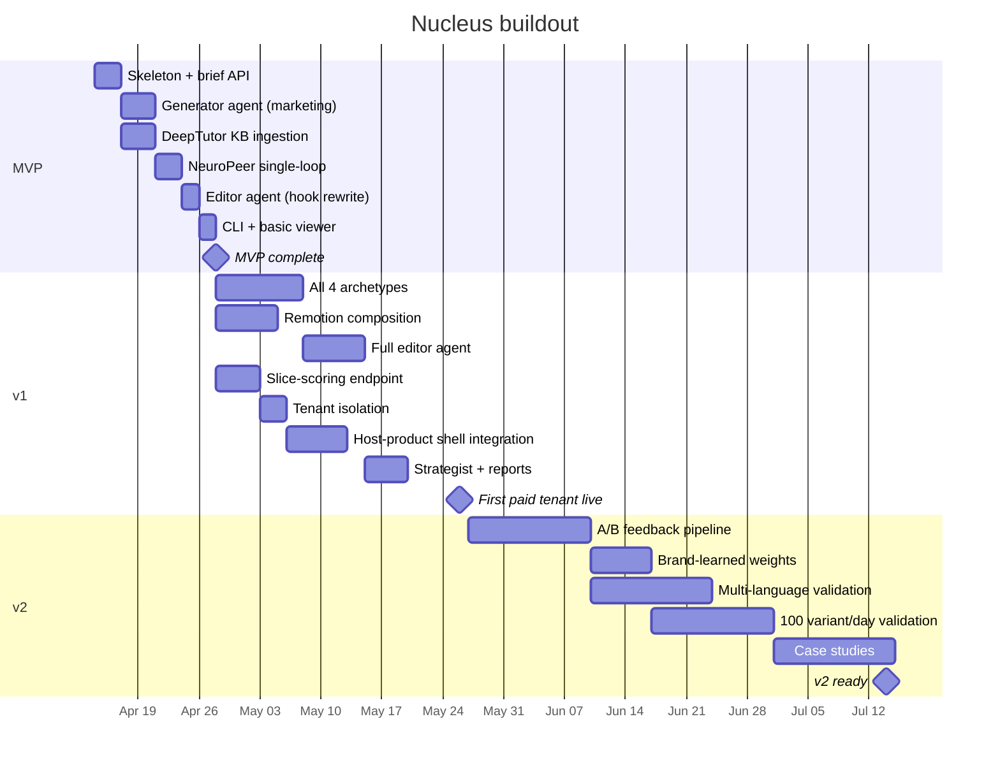

# Roadmap

Three milestones, each built around one constraint: the **MVP is
demonstrable within 2 weeks of kickoff**, **v1 is production-ready for
the first paid tenant within 6 weeks**, and **v2 validates
multi-tenant throughput at 100+ variants per day within 3 months**.

All dates assume a kickoff of April 14, 2026.

## Milestone 0 — Pre-work (already done)

These are the capabilities that already exist in the author's repo
ecosystem and need no further engineering to be usable inside Nucleus.
This is the leverage that makes the rest of the timeline credible.

| Capability | Status | Source |
|---|---|---|
| Neuro scoring API (TRIBE v2) | Shipped Deployed on Railway, API live | NeuroPeer |
| Director agent pattern + 25 tools | Shipped Working Next.js implementation | Neuroflix |
| Brand KB RAG pipeline | Shipped LightRAG / LlamaIndex / RAGAnything | DeepTutor |
| Source footage ingest + segment index | Shipped Marengo embeddings, SSE streaming | Roto |
| Remotion render engine + templates | Shipped Prior brand work in production | ManimStudio |
| Design system | Shipped Full Tailwind + Shadcn component library | ManimStudio |
| Railway + Vercel deployment baseline | Shipped Production | NeuroPeer |

## Milestone 1 — MVP (2 weeks, by April 28)

**Goal:** end-to-end happy path for one archetype, producing one scored
variant at a time, with the recursive loop running under manual
supervision if needed.

### Deliverables

- Nucleus FastAPI service skeleton deployed on Railway
- Brief ingestion endpoint (`POST /api/v1/nucleus/jobs`)
- Generator agent wired to Neuroflix's Director pattern, scoped to
  **marketing archetype only** (avatar + B-roll + music)
- DeepTutor RAG ingestion of one brand's docs (dogfood on TruPeer's
  own content)
- Single-loop integration with NeuroPeer: `/analyze` call, read score
  back, store result
- Editor agent with **one edit primitive only** — hook rewrite
- CLI tool that runs the full loop locally for debugging
- Basic web viewer for the generated variant and the neural report
  (reskinned Roto frontend)
- Integration test: submit a brief, get back a scored variant with an
  iteration history

### Explicit non-goals for MVP

- No host-product shell integration yet
- No multi-tenant brand isolation
- No demo / knowledge / education archetypes
- No Remotion composition layer (marketing archetype uses pure AI gen)
- No strategist agent (no GTM guide in output)
- No score-slice optimization yet (full re-scoring on every iteration)

### What the MVP proves

A recorded walkthrough: "here's the brief, here's the generator
running, here's the score coming back, here's the editor issuing a
hook rewrite, here's the final variant with the score improvement."
Not production-integrated yet — demonstrated as a standalone engine.

## Milestone 2 — v1 (6 weeks, by May 26)

**Goal:** production-grade Nucleus deployed as a capability inside the
host product, serving the first paid design-partner tenant.

### Deliverables

- **All four archetypes supported:** demo, marketing, knowledge, education
- Remotion composition layer for demo and knowledge archetypes
- Full editor agent with all seven edit primitives (hook rewrite, cut
  tightening, music swap, pacing change, narration rewrite, visual
  substitution, caption emphasis) plus ICP re-anchor
- **Slice-scoring endpoint shipped** on the upstream scorer service —
  the one net-new feature required from NeuroPeer
- Multi-tenant brand isolation: each tenant has a private Brand KB,
  private job queue, private report history, row-level isolation in
  Postgres
- Host-product shell integration: Nucleus panel embedded as a
  capability surface inside the host, with the "Multiply" button UX,
  brief form, job queue view, variant viewer, report viewer
- **Strategist agent** producing GTM strategy guides per delivered
  variant
- Full **neural report rendering**: attention curve, brain heatmap,
  key moments, iteration history
- Tenant-scoped observability (per-tenant usage, per-tenant cost,
  per-tenant quality metrics)
- Billing hooks so the host product can meter Nucleus usage per tenant
- First paid design-partner tenant onboarded and producing 20+ variants
  per day

### Critical path items

1. **Slice-scoring endpoint on NeuroPeer.** The upstream change that
   unlocks per-iteration cost efficiency. Needs to ship by week 3 of
   v1.
2. **Tenant isolation.** DeepTutor's KB manager is currently
   single-tenant. Adding tenant scoping is a ~3-day refactor.
3. **Host-product shell integration.** Requires access to the host's
   frontend codebase and an auth handshake. Unblocked by the host's
   engineering team, not by Nucleus itself.
4. **License path resolution.** TRIBE v2's CC BY-NC license must be in
   motion by end of week 2 of v1. If it stalls, the
   `AttentionProxyAnalyzer` fallback moves onto the critical path.

## Milestone 3 — v2 (3 months, by July 14)

**Goal:** Nucleus is a validated platform feature serving multiple
tenants at 100+ variants per day aggregate throughput, with a closed
A/B feedback loop and a reusable extraction path for additional
distribution channels.

### Deliverables

- Aggregate throughput validated at **100+ variants per day** across
  all tenants
- **Parallel candidate generation:** N candidates per brief, top-scoring
  K selected for delivery
- **A/B feedback pipeline:** after variants ship to a brand's social
  channels, Nucleus ingests performance data and feeds it back into
  scoring weights per brand
- **Brand-learned scoring weights:** each brand's weights update over
  time based on which variants actually performed in-market
- **Multi-language validation** across the top 10 languages tenants use
- **Self-serve brand onboarding:** a new tenant can stand up a Nucleus
  brand in under an hour
- Full **observability dashboard** for internal operations
- Case studies from 3+ tenants showing measurable lift (variant volume,
  cost per variant, time to publish)
- **Architectural extraction readiness:** Nucleus engine can be deployed
  as a standalone instance outside the first host-product shell without
  code changes

### Stretch goals for v2

- `AttentionProxyAnalyzer` as a fully trained commercial-safe
  alternative to TRIBE v2 (whether or not the Meta license lands)
- **Semantic variant search** across a tenant's Nucleus history (using
  Roto's Marengo embeddings pipeline)
- **In-frame selection editor:** pick an element in the rendered video,
  prompt the edit, re-score the slice
- Education archetype productionized for long-form explainers (5–15
  minute videos)

## Timeline

## Risks and mitigations

| Risk | Likelihood | Impact | Mitigation |
|---|---|---|---|
| TRIBE v2 commercial license stalls | Medium | High | `AttentionProxyAnalyzer` fallback path documented; kick off the fallback build in parallel to license negotiation |
| Diffusion video provider pricing/API changes | Medium | Medium | Multiple providers behind a single interface; swap at runtime |
| Host-product engineering bandwidth for shell integration | Low | High | Keep the integration surface thin (web component or iframe); unblock with the host's engineering team directly |
| GPU cost explodes with scale | Low | Medium | Slice-scoring endpoint cuts per-iteration cost ~70% |
| Edit loop gets stuck (monotone failure) | Low | Low | Stop condition already designed; escalation to human review is cheap |
| Tenant demands a custom archetype | High | Low | Archetype system is data-driven, not hardcoded — new archetypes are YAML + a render template |
| Brand KB ingestion bottleneck | Medium | Medium | DeepTutor already handles this; add background ingestion queue in v1 |

## Success criteria

### End of v1 (May 26, 2026)

- One paid tenant producing 20+ variants per day through Nucleus
- Average neural score across delivered variants ≥ 72 (default threshold)
- End-to-end cost per variant under $1.00
- Average iteration count ≤ 4 (editor isn't thrashing)
- Host product is billing the tenant and the Nucleus team is receiving
  a margin share
- First tenant is willing to act as a reference for additional tenants

### End of v2 (July 14, 2026)

- Five or more paid tenants on Nucleus
- Aggregate throughput ≥ 100 variants per day
- At least one brand has shown a >20% lift in a social metric
  (engagement, CTR, CPM) vs. their pre-Nucleus baseline
- `AttentionProxyAnalyzer` is in production or the TRIBE v2 license is
  formally closed
- Extraction path validated: Nucleus engine deployable outside the
  first host product shell without code changes
