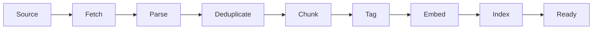

# Brand KB Ingestion

How to load, update, debug, and audit a tenant's Brand Knowledge
Base.

## When to use this runbook

- A tenant has asked for help getting content into their KB
- Ingestion is slow or failing
- A tenant's variants aren't grounded in the right content
- An auditor needs to see what's in a tenant's KB
- A tenant has updated their source material and wants the KB
  refreshed

## The ingestion pipeline (recap)

See [ingestion → brand KB schema](../ingestion/brand-kb-schema.md)
for the full reference. The short version:



Each stage can fail independently. The runbook helps you identify
which stage is the problem.

## Initial KB setup

### Step 1 — Create the Brand KB

```bash
nucleus-admin brand-kb create \
  --tenant-id "$TENANT_ID" \
  --name "$BRAND_NAME Primary KB" \
  --provider lightrag \
  --embedding-model "voyage-3"
```

Output:

```
Brand KB created: abc123
Storage path: /data/nucleus/brand-kbs/$TENANT_ID/abc123/
Ready for documents.
```

### Step 2 — Choose connector(s)

For a new tenant, recommended order:

1. **TruPeer MCP connector** (if they have a TruPeer KB) — fastest
2. **URL crawler** (their marketing site + blog) — 15 minutes
3. **Notion / Confluence / Drive connector** (if they use these) —
   5–60 minutes depending on OAuth
4. **Manual PDF uploads** (brand guidelines, ICP docs) — minutes

### Step 3 — Add the first connector

Example: URL crawler for a brand's marketing site.

```bash
nucleus-admin connectors add \
  --brand-kb-id "$KB_ID" \
  --connector-type url_crawler \
  --config '{
    "seed_urls": ["https://acme.example/"],
    "max_depth": 3,
    "same_domain_only": true,
    "include_patterns": ["/blog/", "/product/", "/pricing"],
    "exclude_patterns": ["/legal/", "/privacy/"]
  }'
```

### Step 4 — Watch the ingestion run

```bash
nucleus-admin brand-kb watch --brand-kb-id "$KB_ID"
```

Streams progress events:

```
[14:23:11] stage=fetch     url=https://acme.example/              status=ok
[14:23:12] stage=parse     url=https://acme.example/              chars=2347
[14:23:12] stage=dedup     url=https://acme.example/              status=new
[14:23:12] stage=chunk     url=https://acme.example/              chunks=4
[14:23:13] stage=tag       url=https://acme.example/              icp=[...] pain=[...]
[14:23:14] stage=embed     url=https://acme.example/              cost=$0.0002
[14:23:14] stage=index     url=https://acme.example/              status=indexed
[14:23:15] stage=fetch     url=https://acme.example/blog/         status=ok
...
```

Typical ingestion rates:

| Source type | Docs per minute |
|---|---|
| URL crawler (polite) | 10–20 |
| PDF upload | 5–10 |
| Notion | 20–40 |
| Confluence | 20–40 |
| Google Drive | 10–20 |
| TruPeer MCP | 50+ (on-demand, not pre-ingested) |

### Step 5 — Verify the KB is populated

```bash
nucleus-admin brand-kb stats --brand-kb-id "$KB_ID"
```

Output:

```
Brand KB: Acme Primary KB
Documents: 124
Chunks: 1,487
Total tokens: ~892k
Languages: en, es
ICP tags: {'Head of Sales Enablement': 23, 'CSM at SaaS': 18, ...}
Pain tags: {'re_record_on_update': 31, 'localization_friction': 22, ...}
Archetype tags: {'demo': 68, 'marketing': 45, 'knowledge': 35, 'education': 12}
Last updated: 2026-04-10T14:35:22Z
```

A well-populated KB for a B2B SaaS tenant typically has:

- **100–1000 documents** for the Starter/Growth tier
- **1000+ documents** for the Enterprise tier
- **Diverse tags** across at least 3 ICPs and 4 pain clusters

## Debugging ingestion failures

### Failure: connector fetch errors

Symptom: `stage=fetch ... status=error` in the watch stream.

1. Check the connector's auth status:
   ```bash
   nucleus-admin connectors status --brand-kb-id "$KB_ID"
   ```
2. Common causes:
   - **URL crawler:** robots.txt blocks, 404s, redirect loops
   - **Notion:** token expired, scope insufficient
   - **Confluence:** authentication failure, space permissions
   - **Drive:** OAuth token expired
   - **MCP:** TruPeer server down
3. For auth failures, re-run the OAuth flow
4. For source-specific errors, check the source manually in a
   browser with the tenant's credentials

### Failure: parsing errors

Symptom: `stage=parse ... status=error`.

1. Check which file type is failing
2. PDF parsing errors are the most common:
   - Image-only PDFs without OCR → enable OCR in the config
   - Corrupted PDFs → tenant needs to re-upload
   - Very large PDFs → may hit the file-size limit
3. Markdown / HTML errors are rare; they usually mean the content
   is malformed

### Failure: embedding errors

Symptom: `stage=embed ... status=error`.

1. Check Voyage AI's status (or whichever embedding provider is
   configured)
2. Check the embedding cost cap — did the tenant hit their
   monthly ceiling?
3. Check the chunk size — very long chunks exceed the embedding
   model's context

### Failure: 0 documents after ingestion

The pipeline ran but nothing is in the KB.

1. Check the connector config — are the `include_patterns` too
   narrow?
2. Check the source — is it actually populated?
3. Check the dedup step — if the tenant ingested the same source
   twice, the second time produces 0 new documents (expected)
4. Check the language filter — if the source is in a language the
   KB rejects, nothing makes it through

### Symptom: variants aren't grounded in the right content

The KB has documents, but generated variants are pulling from the
wrong sections.

1. Check the tags on the retrieved chunks:
   ```bash
   nucleus-admin brand-kb query \
     --brand-kb-id "$KB_ID" \
     --query "hook for product marketers, pain point X" \
     --top-k 10 --verbose
   ```
2. Are the right ICP / pain / archetype tags being applied?
3. If tags look wrong, the tagger might be under-performing on
   this tenant's content — consider a manual tag review
4. If tags look right but retrieval is pulling wrong chunks, the
   embedding model might be mis-ranking — check the
   [RAG query pattern](../ingestion/rag-query-pattern.md) for
   the expected flow

## Manual document management

### Add a single document

```bash
nucleus-admin documents add \
  --brand-kb-id "$KB_ID" \
  --file "/path/to/brand-guidelines.pdf" \
  --icp-tags "all" \
  --pain-tags "brand_voice" \
  --archetype-tags "all"
```

### Remove a document

```bash
nucleus-admin documents remove \
  --brand-kb-id "$KB_ID" \
  --document-id "$DOC_ID"
```

### Re-tag a document

```bash
nucleus-admin documents retag --document-id "$DOC_ID"
```

Runs the tagger again. Useful after updating the tenant's ICP
library (the tagger needs fresh ICP definitions to tag accurately).

### Re-embed a document

```bash
nucleus-admin documents reembed --document-id "$DOC_ID"
```

Rare — only needed if the embedding model was updated or the
content was re-parsed differently.

## Refreshing a KB

When source content changes and the tenant wants the KB updated:

### Automatic refresh

Most connectors poll on a schedule (default 24h). The tenant can
also trigger a manual refresh:

```bash
nucleus-admin connectors refresh --brand-kb-id "$KB_ID" --connector-id "$CONN_ID"
```

### Full re-ingestion

If a tenant wants to start fresh (e.g., after a major website
redesign):

1. Archive the old KB:
   ```bash
   nucleus-admin brand-kb archive --brand-kb-id "$KB_ID"
   ```
2. Create a new KB:
   ```bash
   nucleus-admin brand-kb create --tenant-id "$TENANT_ID" --name "Acme Primary KB v2"
   ```
3. Set up connectors again
4. Point the tenant's default KB to the new one:
   ```bash
   nucleus-admin tenants set-default-kb --tenant-id "$TENANT_ID" --brand-kb-id "$NEW_KB_ID"
   ```
5. Archive the old KB's variants if needed

## Auditing a KB

For compliance requests or customer inquiries:

### List all documents

```bash
nucleus-admin brand-kb documents --brand-kb-id "$KB_ID" --format json > kb-export.json
```

### Search by content

```bash
nucleus-admin brand-kb search \
  --brand-kb-id "$KB_ID" \
  --query "customer X mentioned in" \
  --top-k 50
```

### Export a data-subject view

For GDPR Article 15 requests, export all documents referencing a
specific identifier:

```bash
nucleus-admin brand-kb data-subject-export \
  --brand-kb-id "$KB_ID" \
  --identifier "john.doe@example.com"
```

### Delete data-subject content

For Article 17 erasure requests:

```bash
nucleus-admin brand-kb data-subject-delete \
  --brand-kb-id "$KB_ID" \
  --identifier "john.doe@example.com"
```

## Cost of KB operations

Rough cost per operation:

| Operation | Cost |
|---|---|
| Ingest 1 document (parse + chunk + tag + embed) | ~$0.001 |
| Query the KB (embed + retrieve + rerank) | < $0.002 |
| Re-embed a document | ~$0.0003 |
| Re-tag a document (LLM call) | ~$0.001 |
| Data-subject export | Free (SQL-only) |
| Data-subject delete | Free (SQL-only) |

For a typical tenant with 500 documents and 100 queries per day,
KB operations cost < $5/month.

## What this runbook doesn't cover

- **The full ingestion pipeline code** — see
  [ingestion → connectors](../ingestion/connectors.md)
- **Custom connectors** — handled per-tenant by engineering, not
  runbook ops
- **KB migration between embedding models** — rare enough to be
  an engineering project, not an ops task
- **Cross-tenant content leakage** — handled by the incident
  response runbook
