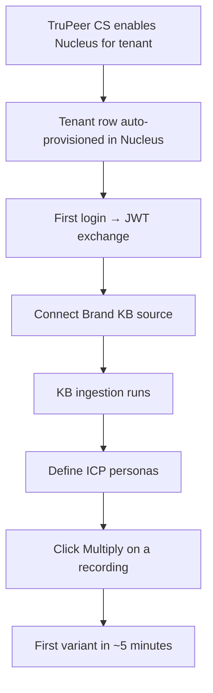

# Onboarding a New Tenant

How to bring a new customer onto Nucleus from zero to "producing
their first variant."

## When to use this runbook

A new TruPeer customer has requested Nucleus access (or TruPeer
customer success has enabled it for them). The customer:

- Has an active TruPeer account
- Has at least one source recording in TruPeer
- Is on a TruPeer tier that includes Nucleus (Growth or
  Enterprise)

## The end-to-end flow



Expected end-to-end time: **30–60 minutes of active work** +
~1 hour of background ingestion.

## Step-by-step

### Step 1 — Enable Nucleus for the tenant in TruPeer

Done by TruPeer customer success, not Nucleus. They toggle the
feature flag in TruPeer's admin UI, which triggers a webhook to
Nucleus.

If the webhook failed, manually create the tenant:

```bash
nucleus-admin tenants create \
  --host-tenant-id "$HOST_TENANT_ID" \
  --name "Acme Corp" \
  --plan enterprise_addon
```

### Step 2 — First login and JWT exchange

The tenant clicks "Multiply" on any recording in TruPeer. The
TruPeer UI exchanges a JWT for a Nucleus session cookie.

**Verify:** Check the Nucleus API logs for the session creation
event:

```bash
grep "auth.session_created" /var/log/nucleus/api.log | grep "$HOST_TENANT_ID"
```

If the session creation fails, check:

1. Is the JWT signed with the current shared key?
2. Is the `host_tenant_id` in the JWT mapped to a Nucleus tenant?
3. Is the tenant's status `active` (not `suspended` or
   `deleted`)?

### Step 3 — Connect a Brand KB source

The tenant has four options in the Nucleus panel:

1. **Use TruPeer's MCP server** (fastest — auto-connects to
   existing TruPeer KB)
2. **Upload PDFs and Markdown** manually
3. **Connect Notion / Confluence / Google Drive** via OAuth
4. **Crawl the brand's marketing site** by URL

**Recommended for first-time tenants:** the MCP connector. It
gives them a usable Brand KB in under 5 minutes without any
manual upload.

**Set up the MCP connector:**

```bash
nucleus-admin brand-kb create \
  --tenant-id "$TENANT_ID" \
  --name "Acme Primary KB" \
  --source trupeer_mcp
```

The tenant walks through the OAuth consent flow in their browser.
After they approve, the KB is ready.

### Step 4 — Wait for ingestion

Ingestion runs in the background. A typical TruPeer MCP ingestion
takes **5–20 minutes** depending on KB size.

**Check ingestion status:**

```bash
nucleus-admin brand-kb status --tenant-id "$TENANT_ID"
```

Output:

```
Brand KB: Acme Primary KB (ID: ...)
Status: ingesting
Documents: 47 / 124
Chunks: 892 / 1240
Last update: 2026-04-10T14:23:11Z
```

If ingestion is stuck for > 30 minutes, check the provider error
logs:

```bash
nucleus-admin brand-kb logs --tenant-id "$TENANT_ID" --limit 50
```

### Step 5 — Define ICP personas

The tenant needs at least one ICP defined before they can run a
brief. They can:

1. **Import from TruPeer's existing persona library** (if TruPeer
   has one)
2. **Create personas manually** via the Nucleus UI
3. **Let Nucleus auto-suggest** based on the Brand KB content

**Auto-suggest:**

```bash
nucleus-admin icp-personas suggest \
  --tenant-id "$TENANT_ID" \
  --brand-kb-id "$KB_ID" \
  --count 5
```

The auto-suggest pulls the top 5 ICPs mentioned in the KB,
cross-referenced with the tenant's blog posts and use-case pages.
The tenant reviews and edits as needed.

### Step 6 — First brief

The tenant clicks "Multiply" on a recording in TruPeer. The
Nucleus panel opens. They:

1. Pick 1 ICP (recommend: the tenant's best-understood persona)
2. Pick 1 language (recommend: start with English)
3. Pick 1 archetype (recommend: start with demo for TruPeer
   customers, marketing for pure-social customers)
4. Pick 1 platform (recommend: whatever they publish to most
   often)
5. Keep defaults for threshold (72) and max iterations (5)
6. Click Generate

**For the first brief only, watch it from the admin dashboard:**

```bash
nucleus-admin jobs watch --tenant-id "$TENANT_ID" --latest
```

This streams the state transitions in real time. The first brief
typically completes in **5–10 minutes** including the full loop.

### Step 7 — Verify the delivered variant

Expected outputs:

- 1 delivered variant (MP4)
- 1 neural report (PDF)
- 1 GTM strategy guide (PDF)
- 1 iteration history (typically 2–4 iterations)

**Verify the variant played correctly:**

```bash
nucleus-admin jobs verify --job-id "$JOB_ID"
```

This checks:

- The MP4 file is valid (duration matches expected, no empty
  frames)
- The neural report has all sections
- The GTM guide has all sections
- The usage event was emitted

### Step 8 — Hand off to the tenant

At this point, the tenant has a working Nucleus deployment. Send
them the welcome email with:

- Link to the Nucleus panel inside TruPeer
- Link to the public Nucleus docs (this site)
- The per-tenant analytics URL
- Their customer success contact
- The support email

## Troubleshooting

### "JWT signature invalid"

The shared signing key between TruPeer and Nucleus is wrong.

1. Check the current key in `$NUCLEUS_JWT_PUBLIC_KEY`
2. Check TruPeer's key in their secret manager
3. If they differ, rotate to match
4. Retry the session creation

### "Brand KB ingestion failed: 0 documents"

The MCP connector didn't find any documents. Either:

1. The tenant's TruPeer KB is empty (they need to populate it in
   TruPeer first)
2. The OAuth scope is wrong (needs `mcp:read`)
3. TruPeer's MCP server is down (check
   `status.trupeer.ai`)

### "ICP auto-suggest returned 0 personas"

The Brand KB doesn't have enough content for the LLM to extract
personas from. Ask the tenant to:

1. Upload some existing marketing / positioning content
2. Manually create at least 1 ICP
3. Re-run the auto-suggest after the KB has ≥ 20 documents

### "First brief ran but no variant was delivered"

Check the job status:

```bash
nucleus-admin jobs status --job-id "$JOB_ID"
```

If status is `failed`:

- Check the `terminal_reason` field
- Most common: `provider_error` — follow the
  [provider failure runbook](provider-failure.md)

If status is `complete` but no variant:

- Check the cross-product expansion — did `plan.expand` actually
  create any candidates?
- Check the candidate statuses — did they all fail?

### "First brief took > 30 minutes"

Expected time is 5–10 minutes. Longer means something is slow:

1. Check the GPU queue depth
2. Check the provider latencies
3. Check the cross-product expansion size (did the tenant
   accidentally select 10 ICPs × 10 languages?)
4. Check for stuck candidates (follow
   [stuck job recovery](stuck-job-recovery.md))

## Success criteria

A tenant is considered successfully onboarded if:

1. They've generated at least 1 variant successfully
2. They've viewed the neural report
3. They've downloaded the variant for use outside Nucleus
4. They've logged back into Nucleus a second time
5. They know how to create a new brief without help

Track these in the customer success CRM. Tenants who meet all 5
criteria in the first week typically stay on the product.

## Expected time commitments

| Role | Time |
|---|---|
| Tenant (active work) | 30–60 minutes |
| Customer success | 15 minutes (guiding the first brief) |
| Engineering (ingestion + first job) | Zero, unless something breaks |
| **Total wall-clock time** | 1–2 hours end-to-end |

If any tenant takes more than 2 hours of wall-clock time to get
their first variant, escalate to engineering — something in the
onboarding path is broken and needs a fix.
